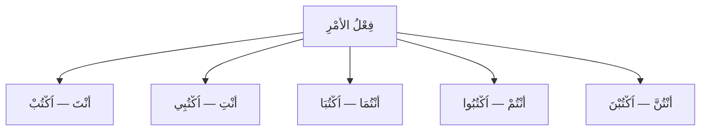

# فِعْلُ الأَمْرِ — Le verbe à l'impératif (l'ordre)

Voir aussi : [[Al-Fi3l Al-Madi - Le passe]] · [[Al-Fi3l Al-Mudari3 - Le present]] · [[Al-Jumla Al-Fi3liyya - La phrase verbale]]

---

## C'est quoi le أَمْر ?

> [!info]
> Le **فِعْلُ الأَمْرِ** est un verbe qui exprime un **ordre** ou une **demande**. Il ne s'adresse qu'au **[[Damaair Al-Mukhatab - 2eme personne|المُخَاطَب]]** (2ème personne).
>
> On ne peut pas donner un ordre à soi-même ni à un absent !

---

## Comment former le أَمْر ?

> [!warning]
> **La règle :**
> 1. Prends le **مُضَارِع** avec أَنْتَ
> 2. **Supprime** le préfixe تَـ
> 3. Mets un **سُكُون** (ْ) à la fin
> 4. Si le mot commence par une consonne sans voyelle → ajoute un **ا** (hamza de liaison) au début
>
> تَكْتُبُ → كْتُبْ → **اُكْتُبْ** (écris !)

---

## La conjugaison du أَمْر

Prenons le verbe **اُكْتُبْ** (écrire) :

| الضَّمِيرُ | المُضَارِعُ | الأَمْرُ | Traduction |
|---|---|---|---|
| أَنْتَ | تَكْتُبُ | **اُكْتُبْ** | écris ! (masc.) |
| أَنْتِ | تَكْتُبِينَ | **اُكْتُبِي** | écris ! (fém.) |
| أَنْتُمَا | تَكْتُبَانِ | **اُكْتُبَا** | écrivez ! (vous deux) |
| أَنْتُمْ | تَكْتُبُونَ | **اُكْتُبُوا** | écrivez ! (masc.) |
| أَنْتُنَّ | تَكْتُبْنَ | **اُكْتُبْنَ** | écrivez ! (fém.) |

---

## Exemples avec différents verbes

| المُضَارِعُ (هُوَ) | الأَمْرُ (أَنْتَ) | الأَمْرُ (أَنْتُمْ) | Sens |
|---|---|---|---|
| يَذْهَبُ | **اِذْهَبْ** | **اِذْهَبُوا** | va ! / allez ! |
| يَجْلِسُ | **اِجْلِسْ** | **اِجْلِسُوا** | assieds-toi ! / asseyez-vous ! |
| يَفْتَحُ | **اِفْتَحْ** | **اِفْتَحُوا** | ouvre ! / ouvrez ! |
| يَأْكُلُ | **كُلْ** | **كُلُوا** | mange ! / mangez ! |
| يَقْرَأُ | **اِقْرَأْ** | **اِقْرَؤُوا** | lis ! / lisez ! |
| يَدْرُسُ | **اُدْرُسْ** | **اُدْرُسُوا** | étudie ! / étudiez ! |

---

## Le إِعْرَاب du أَمْر

> [!info]
> Le فِعْلُ الأَمْرِ est toujours **مَبْنِيٌّ عَلَى السُّكُونِ** (construit sur le sukūn). Il ne change pas de إِعْرَاب.
>
> Sauf :
> - Avec **وَاوُ الجَمَاعَةِ** (أَنْتُمْ) → مَبْنِيٌّ عَلَى حَذْفِ النُّونِ (le نُون tombe)
> - Avec **يَاءُ المُؤَنَّثَةِ** (أَنْتِ) → مَبْنِيٌّ عَلَى حَذْفِ النُّونِ
> - Avec **أَلِفُ الاِثْنَيْنِ** (أَنْتُمَا) → مَبْنِيٌّ عَلَى حَذْفِ النُّونِ

---

## L'interdiction (النَّهْيُ) — Ne fais pas !

> [!warning]
> Pour dire "**ne fais pas**", on n'utilise PAS le أَمْر. On utilise :
>
> **لَا** + **المُضَارِعُ المَجْزُومُ**
>
> | Phrase | Traduction |
> |---|---|
> | **لَا** تَكْتُبْ | N'écris pas ! |
> | **لَا** تَذْهَبْ | Ne pars pas ! |
> | **لَا** تَأْكُلْ | Ne mange pas ! |
> | **لَا** تَكْذِبْ | Ne mens pas ! |

---

## Exemples en situation

| Phrase | Traduction | Contexte |
|---|---|---|
| **اُكْتُبْ** الدَّرْسَ ! | Écris la leçon ! | professeur → élève (m.) |
| **اُكْتُبِي** الدَّرْسَ ! | Écris la leçon ! | professeur → élève (f.) |
| **اِذْهَبُوا** إِلَى الفَصْلِ ! | Allez en classe ! | à un groupe |
| **اِقْرَأْ** القُرْآنَ | Lis le Coran | |
| **اِجْلِسْ** هُنَا | Assieds-toi ici | |
| **كُلُوا** وَ**اِشْرَبُوا** | Mangez et buvez | verset coranique |
| **لَا** تَكْذِبْ ! | Ne mens pas ! | interdiction |

---

## Les 3 temps — Résumé comparatif

| | المَاضِي | المُضَارِعُ | الأَمْرُ |
|---|---|---|---|
| **Temps** | Passé | Présent/Futur | Ordre |
| **Exemple** | كَتَبَ | يَكْتُبُ | اُكْتُبْ |
| **Traduction** | il a écrit | il écrit | écris ! |
| **مُعْرَب ?** | Non (مَبْنِيٌّ) | **Oui** (مُعْرَبٌ) | Non (مَبْنِيٌّ) |
| **Pour qui ?** | Tout le monde | Tout le monde | **المُخَاطَب seulement** |

---

## 🧠 Résumé

> [!tip]
> **فِعْلُ الأَمْرِ :**
> - Exprime un **ordre** → seulement au المُخَاطَب (2ème personne)
> - Formation : مُضَارِع − تَـ + سُكُون (+ hamza si besoin)
> - Toujours **مَبْنِيٌّ** (pas de إِعْرَاب)
> - L'interdiction = **لَا** + مُضَارِعٌ مَجْزُومٌ (PAS le أَمْر)
