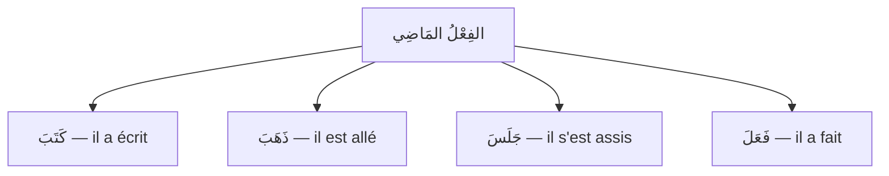

# الفِعْلُ المَاضِي — Le verbe au passé

Voir aussi : [[Al-Fi3l Al-Mudari3 - Le present]] · [[Al-Fi3l Al-Amr - L'ordre]] · [[Al-Jumla Al-Fi3liyya - La phrase verbale]]

---

## C'est quoi le مَاضِي ?

> [!info]
> Le **الفِعْلُ المَاضِي** est un verbe qui indique une action qui s'est **déjà passée** (le passé).
>
> En arabe, le passé est la **forme de base** du verbe. C'est la forme qu'on trouve dans le dictionnaire.

---

## La conjugaison du مَاضِي

Le verbe au passé change sa **terminaison** selon le pronom. Le radical reste le même.

Prenons le verbe **كَتَبَ** (écrire) :

### مَعَ المُتَكَلِّمِ (1ère personne)

| الضَّمِيرُ | الفِعْلُ | Traduction |
|---|---|---|
| أَنَا | كَتَبْ**تُ** | j'ai écrit |
| نَحْنُ | كَتَبْ**نَا** | nous avons écrit |

### مَعَ المُخَاطَبِ (2ème personne)

| الضَّمِيرُ | الفِعْلُ | Traduction |
|---|---|---|
| أَنْتَ | كَتَبْ**تَ** | tu as écrit (masc.) |
| أَنْتِ | كَتَبْ**تِ** | tu as écrit (fém.) |
| أَنْتُمَا | كَتَبْ**تُمَا** | vous deux avez écrit |
| أَنْتُمْ | كَتَبْ**تُمْ** | vous avez écrit (masc.) |
| أَنْتُنَّ | كَتَبْ**تُنَّ** | vous avez écrit (fém.) |

### مَعَ الغَائِبِ (3ème personne)

| الضَّمِيرُ | الفِعْلُ | Traduction |
|---|---|---|
| هُوَ | كَتَبَ | il a écrit |
| هِيَ | كَتَبَ**تْ** | elle a écrit |
| هُمَا (m.) | كَتَبَ**ا** | ils deux ont écrit |
| هُمَا (f.) | كَتَبَ**تَا** | elles deux ont écrit |
| هُمْ | كَتَبُ**وا** | ils ont écrit |
| هُنَّ | كَتَبْ**نَ** | elles ont écrit |

> [!warning]
> **Les terminaisons à retenir :**
>
> | Pronom | Terminaison |
> |---|---|
> | أَنَا | **ـتُ** |
> | أَنْتَ | **ـتَ** |
> | أَنْتِ | **ـتِ** |
> | هُوَ | (rien, c'est la base) |
> | هِيَ | **ـتْ** |
> | هُمْ | **ـوا** |
> | نَحْنُ | **ـنَا** |

---

## Exemples avec différents verbes

| الفِعْلُ | أَنَا | هُوَ | هِيَ | هُمْ |
|---|---|---|---|---|
| **ذَهَبَ** (aller) | ذَهَبْتُ | ذَهَبَ | ذَهَبَتْ | ذَهَبُوا |
| **جَلَسَ** (s'asseoir) | جَلَسْتُ | جَلَسَ | جَلَسَتْ | جَلَسُوا |
| **فَتَحَ** (ouvrir) | فَتَحْتُ | فَتَحَ | فَتَحَتْ | فَتَحُوا |
| **أَكَلَ** (manger) | أَكَلْتُ | أَكَلَ | أَكَلَتْ | أَكَلُوا |
| **شَرِبَ** (boire) | شَرِبْتُ | شَرِبَ | شَرِبَتْ | شَرِبُوا |

---

## Le مَاضِي dans une phrase

> [!info]
> Le verbe المَاضِي est toujours **مَبْنِيٌّ** (invariable). Son إِعْرَاب ne change pas. C'est le [[Al-Jumla Al-Fi3liyya - La phrase verbale|فَاعِل]] qui prend le إِعْرَاب.

| Phrase | Traduction | Analyse |
|---|---|---|
| **كَتَبَ** الطَّالِبُ الدَّرْسَ | L'étudiant a écrit la leçon | كَتَبَ = فِعْلٌ مَاضٍ, الطَّالِبُ = فَاعِلٌ مَرْفُوعٌ, الدَّرْسَ = مَفْعُولٌ بِهِ مَنْصُوبٌ |
| **ذَهَبَتْ** فَاطِمَةُ إِلَى المَدْرَسَةِ | Fatima est allée à l'école | ذَهَبَتْ = فِعْلٌ مَاضٍ (تْ car مُؤَنَّثٌ) |
| **أَكَلْنَا** الطَّعَامَ | Nous avons mangé la nourriture | أَكَلْنَا = فِعْلٌ + ضَمِيرٌ |

---

## 🧠 Résumé

> [!tip]
> **الفِعْلُ المَاضِي :**
> - Action **terminée** (passé)
> - C'est la **forme de base** du verbe arabe
> - On ajoute des **terminaisons** selon le pronom
> - Le verbe est **مَبْنِيٌّ** (ne change pas de إِعْرَاب)
> - Forme de base = 3ème personne masc. sing. (هُوَ فَعَلَ)
