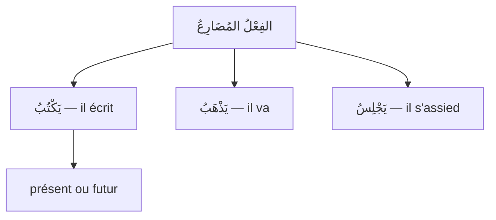

# الفِعْلُ المُضَارِعُ — Le verbe au présent

Voir aussi : [[Al-Fi3l Al-Madi - Le passe]] · [[Al-Fi3l Al-Amr - L'ordre]] · [[Al-Jumla Al-Fi3liyya - La phrase verbale]]

---

## C'est quoi le مُضَارِع ?

> [!info]
> Le **الفِعْلُ المُضَارِعُ** est un verbe qui indique une action qui se passe **maintenant** (présent) ou **dans le futur**.
>
> C'est le seul verbe qui est **مُعْرَبٌ** (son إِعْرَاب peut changer).

---

## Comment former le مُضَارِع ?

On prend le radical du verbe et on ajoute un **préfixe** (lettre au début) :

> [!warning]
> **Les 4 lettres du مُضَارِع : أَنَيْتُ**
>
> | Lettre | Pour qui |
> |---|---|
> | **أَ** (hamza) | أَنَا |
> | **نَ** (noun) | نَحْنُ |
> | **يَ** (ya) | هُوَ / هُمَا / هُمْ |
> | **تَ** (ta) | أَنْتَ / أَنْتِ / أَنْتُمْ / هِيَ / هُنَّ |
>
> Moyen mnémotechnique : **أَنَيْتُ** = "j'ai souffert" (les 4 lettres أ ن ي ت)

---

## La conjugaison du مُضَارِع

Prenons le verbe **يَكْتُبُ** (écrire) :

### مَعَ المُتَكَلِّمِ (1ère personne)

| الضَّمِيرُ | الفِعْلُ | Traduction | Préfixe |
|---|---|---|---|
| أَنَا | **أَ**كْتُبُ | j'écris | أَ |
| نَحْنُ | **نَ**كْتُبُ | nous écrivons | نَ |

### مَعَ المُخَاطَبِ (2ème personne)

| الضَّمِيرُ | الفِعْلُ | Traduction | Préfixe + suffixe |
|---|---|---|---|
| أَنْتَ | **تَ**كْتُبُ | tu écris (m.) | تَ |
| أَنْتِ | **تَ**كْتُبِ**ينَ** | tu écris (f.) | تَ...ينَ |
| أَنْتُمَا | **تَ**كْتُبَ**انِ** | vous deux écrivez | تَ...انِ |
| أَنْتُمْ | **تَ**كْتُبُ**ونَ** | vous écrivez (m.) | تَ...ونَ |
| أَنْتُنَّ | **تَ**كْتُبْ**نَ** | vous écrivez (f.) | تَ...نَ |

### مَعَ الغَائِبِ (3ème personne)

| الضَّمِيرُ | الفِعْلُ | Traduction | Préfixe + suffixe |
|---|---|---|---|
| هُوَ | **يَ**كْتُبُ | il écrit | يَ |
| هِيَ | **تَ**كْتُبُ | elle écrit | تَ |
| هُمَا (m.) | **يَ**كْتُبَ**انِ** | ils deux écrivent | يَ...انِ |
| هُمَا (f.) | **تَ**كْتُبَ**انِ** | elles deux écrivent | تَ...انِ |
| هُمْ | **يَ**كْتُبُ**ونَ** | ils écrivent | يَ...ونَ |
| هُنَّ | **يَ**كْتُبْ**نَ** | elles écrivent | يَ...نَ |

---

## Le إِعْرَاب du مُضَارِع

> [!warning]
> Le مُضَارِع est le seul verbe qui a un **إِعْرَاب** (il peut changer) :
>
> | État | Signe | Quand ? |
> |---|---|---|
> | **مَرْفُوعٌ** | **ُ** (damma) | Par défaut (pas de particule avant) |
> | **مَنْصُوبٌ** | **َ** (fatha) | Après **لَنْ** / **أَنْ** / **كَيْ** / **لِـ** |
> | **مَجْزُومٌ** | **سُكُونْ ْ** | Après **لَمْ** / **لَا** (النَّهْيُ) |

### Exemples :

| Phrase | État | Pourquoi |
|---|---|---|
| يَكْتُبُ الدَّرْسَ | **مَرْفُوعٌ** | pas de particule |
| **لَنْ** يَكْتُبَ | **مَنْصُوبٌ** | après لَنْ (il n'écrira pas) |
| **لَمْ** يَكْتُبْ | **مَجْزُومٌ** | après لَمْ (il n'a pas écrit) |

---

## Le futur avec سَوْفَ / سَـ

> [!info]
> Pour dire le **futur**, on ajoute **سَـ** (bientôt) ou **سَوْفَ** (plus tard) avant le مُضَارِع :
>
> | Phrase | Traduction |
> |---|---|
> | **سَـ**أَذْهَبُ | Je vais aller (bientôt) |
> | **سَوْفَ** أَذْهَبُ | J'irai (plus tard) |
> | **سَـ**يَكْتُبُ الرِّسَالَةَ | Il va écrire la lettre |

---

## Exemples avec différents verbes

| الفِعْلُ (مَاضٍ) | الفِعْلُ (مُضَارِع — هُوَ) | أَنَا | Sens |
|---|---|---|---|
| ذَهَبَ | **يَذْهَبُ** | أَذْهَبُ | aller |
| جَلَسَ | **يَجْلِسُ** | أَجْلِسُ | s'asseoir |
| فَتَحَ | **يَفْتَحُ** | أَفْتَحُ | ouvrir |
| أَكَلَ | **يَأْكُلُ** | آكُلُ | manger |
| شَرِبَ | **يَشْرَبُ** | أَشْرَبُ | boire |
| دَرَسَ | **يَدْرُسُ** | أَدْرُسُ | étudier |

---

## 🧠 Résumé

> [!tip]
> **الفِعْلُ المُضَارِعُ :**
> - Action **en cours** (présent) ou **future** (avec سَـ / سَوْفَ)
> - Préfixes **أَنَيْتُ** : أَ (أَنَا), نَ (نَحْنُ), يَ (هُوَ...), تَ (أَنْتَ/هِيَ...)
> - Seul verbe **مُعْرَبٌ** : مَرْفُوعٌ (ُ), مَنْصُوبٌ (َ après لَنْ), مَجْزُومٌ (ْ après لَمْ)
