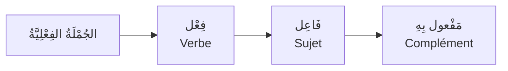

# الجُمْلَةُ الفِعْلِيَّةُ — La phrase verbale

Voir aussi : [[Al-Fi3l Al-Madi - Le passe]] · [[Al-Fi3l Al-Mudari3 - Le present]] · [[Al-Fi3l Al-Amr - L'ordre]]

---

## C'est quoi la جُمْلَة فِعْلِيَّة ?

> [!info]
> Une **جُمْلَةٌ فِعْلِيَّةٌ** est une phrase qui **commence par un verbe**.
>
> Elle se compose de **3 éléments** :

| العُنْصُرُ | C'est quoi ? | إِعْرَاب |
|---|---|---|
| **الفِعْلُ** | L'action (verbe) | مَبْنِيٌّ (invariable) — sauf المُضَارِع |
| **الفَاعِلُ** | Celui qui **fait** l'action | toujours **مَرْفُوعٌ** |
| **المَفْعُولُ بِهِ** | Celui qui **reçoit** l'action | toujours **مَنْصُوبٌ** |

---

## L'ordre des mots

> [!warning]
> En arabe, l'ordre est : **فِعْلٌ + فَاعِلٌ + مَفْعُولٌ بِهِ**
>
> C'est l'inverse du français ! En français : Sujet + Verbe + Complément
>
> | Français | Arabe |
> |---|---|
> | **L'élève** a lu **le livre** | **قَرَأَ** **الطَّالِبُ** **الكِتَابَ** |
> | Sujet + Verbe + Objet | Verbe + Sujet + Objet |

---

## الفَاعِلُ — Celui qui fait l'action

> [!info]
> Le **فَاعِل** est toujours **[[Revision - Grammaire Arabe|مَرْفُوع]]** (sujet).

| Phrase | الفَاعِلُ | Signe du مَرْفُوع |
|---|---|---|
| كَتَبَ **الطَّالِبُ** | الطَّالِبُ | ُ ضَمَّة |
| جَاءَ **أَبُوكَ** | أَبُوكَ | و (أَسْمَاءٌ خَمْسَة) |
| نَجَحَ **الطَّالِبَانِ** | الطَّالِبَانِ | انِ (مُثَنَّى) |
| ذَهَبَ **المُسْلِمُونَ** | المُسْلِمُونَ | ونَ (جَمْعُ مُذَكَّرٍ سَالِمٌ) |

### Le فَاعِل peut être caché (مُسْتَتِر)

Quand le pronom est **évident**, on ne le montre pas :

| Phrase | الفَاعِلُ | Explication |
|---|---|---|
| **كَتَبْتُ** الدَّرْسَ | أَنَا (مُسْتَتِرٌ) | le تُ indique déjà "je" |
| **ذَهَبُوا** إِلَى البَيْتِ | وَاوُ الجَمَاعَةِ | le وا indique "ils" |
| **يَكْتُبُ** الدَّرْسَ | هُوَ (مُسْتَتِرٌ) | la forme du verbe indique "il" |

---

## المَفْعُولُ بِهِ — Celui qui reçoit l'action

> [!info]
> Le **مَفْعُولٌ بِهِ** est toujours **[[Revision - Grammaire Arabe|مَنْصُوب]]** (complément d'objet).

| Phrase | المَفْعُولُ بِهِ | Signe du مَنْصُوب |
|---|---|---|
| قَرَأَ الطَّالِبُ **الكِتَابَ** | الكِتَابَ | َ فَتْحَة |
| رَأَيْتُ **أَبَاكَ** | أَبَاكَ | ا (أَسْمَاءٌ خَمْسَة) |
| رَأَيْتُ **الطَّالِبَيْنِ** | الطَّالِبَيْنِ | يْنِ (مُثَنَّى) |
| رَأَيْتُ **المُسْلِمِينَ** | المُسْلِمِينَ | ينَ (جَمْعُ مُذَكَّرٍ سَالِمٌ) |

### Le مَفْعُولٌ بِهِ peut être un pronom attaché

| Phrase | المَفْعُولُ بِهِ | Traduction |
|---|---|---|
| رَأَيْتُ**هُ** | هُ (lui) | Je l'ai vu |
| عَلَّمَ**نِي** | نِي (moi) | Il m'a enseigné |
| أَعْطَيْتُ**هُمْ** الكِتَابَ | هُمْ (eux) + الكِتَابَ | Je leur ai donné le livre |

---

## Phrases complètes : analyse

### Exemple 1 : كَتَبَ الطَّالِبُ الدَّرْسَ

| Mot | الإِعْرَابُ | Pourquoi |
|---|---|---|
| **كَتَبَ** | فِعْلٌ مَاضٍ مَبْنِيٌّ عَلَى الفَتْحِ | verbe au passé |
| **الطَّالِبُ** | فَاعِلٌ مَرْفُوعٌ بِالضَّمَّةِ | celui qui écrit |
| **الدَّرْسَ** | مَفْعُولٌ بِهِ مَنْصُوبٌ بِالفَتْحَةِ | ce qui est écrit |

### Exemple 2 : يَقْرَأُ المُعَلِّمُ القُرْآنَ

| Mot | الإِعْرَابُ | Pourquoi |
|---|---|---|
| **يَقْرَأُ** | فِعْلٌ مُضَارِعٌ مَرْفُوعٌ بِالضَّمَّةِ | verbe au présent |
| **المُعَلِّمُ** | فَاعِلٌ مَرْفُوعٌ بِالضَّمَّةِ | celui qui lit |
| **القُرْآنَ** | مَفْعُولٌ بِهِ مَنْصُوبٌ بِالفَتْحَةِ | ce qui est lu |

### Exemple 3 : أَكَلَ الوَلَدُ التُّفَّاحَةَ

| Mot | الإِعْرَابُ | Pourquoi |
|---|---|---|
| **أَكَلَ** | فِعْلٌ مَاضٍ مَبْنِيٌّ عَلَى الفَتْحِ | verbe au passé |
| **الوَلَدُ** | فَاعِلٌ مَرْفُوعٌ بِالضَّمَّةِ | celui qui mange |
| **التُّفَّاحَةَ** | مَفْعُولٌ بِهِ مَنْصُوبٌ بِالفَتْحَةِ | ce qui est mangé |

---

## Phrases sans مَفْعُولٌ بِهِ (verbes intransitifs)

> [!tip]
> Certains verbes n'ont **pas de مَفْعُولٌ بِهِ** car l'action ne "tombe" sur personne :

| Phrase | Traduction | Analyse |
|---|---|---|
| **ذَهَبَ** الطَّالِبُ | L'élève est parti | فِعْلٌ + فَاعِلٌ (pas de مَفْعُولٌ بِهِ) |
| **جَلَسَ** الرَّجُلُ | L'homme s'est assis | فِعْلٌ + فَاعِلٌ |
| **نَامَ** الوَلَدُ | Le garçon a dormi | فِعْلٌ + فَاعِلٌ |
| **جَاءَ** المُعَلِّمُ | Le prof est venu | فِعْلٌ + فَاعِلٌ |

---

## جُمْلَةٌ فِعْلِيَّةٌ vs جُمْلَةٌ اسْمِيَّةٌ

> [!warning]
> **Ne confonds pas !**
>
> | | الجُمْلَةُ الفِعْلِيَّةُ | الجُمْلَةُ الاسْمِيَّةُ |
> |---|---|---|
> | **Commence par** | فِعْلٌ (verbe) | اسْمٌ (nom) |
> | **Structure** | فِعْلٌ + فَاعِلٌ + (مَفْعُولٌ بِهِ) | مُبْتَدَأٌ + خَبَرٌ |
> | **Exemple** | **كَتَبَ** الطَّالِبُ الدَّرْسَ | **الطَّالِبُ** كَتَبَ الدَّرْسَ |
> | **Traduction** | L'étudiant a écrit la leçon | L'étudiant, il a écrit la leçon |

---

## 🧠 Résumé

> [!tip]
> **الجُمْلَةُ الفِعْلِيَّةُ = فِعْلٌ + فَاعِلٌ + مَفْعُولٌ بِهِ**
>
> | Élément | Rôle | إِعْرَاب |
> |---|---|---|
> | الفِعْلُ | L'action | مَبْنِيٌّ |
> | الفَاعِلُ | Qui fait ? | **مَرْفُوعٌ** toujours |
> | المَفْعُولُ بِهِ | Qui reçoit ? | **مَنْصُوبٌ** toujours |
>
> **Astuce :**
> - **Qui fait l'action ?** → فَاعِلٌ → **مَرْفُوعٌ** (ُ)
> - **Qui reçoit l'action ?** → مَفْعُولٌ بِهِ → **مَنْصُوبٌ** (َ)
> - Pas de مَفْعُولٌ بِهِ si le verbe est intransitif (ذَهَبَ, جَلَسَ, نَامَ...)
