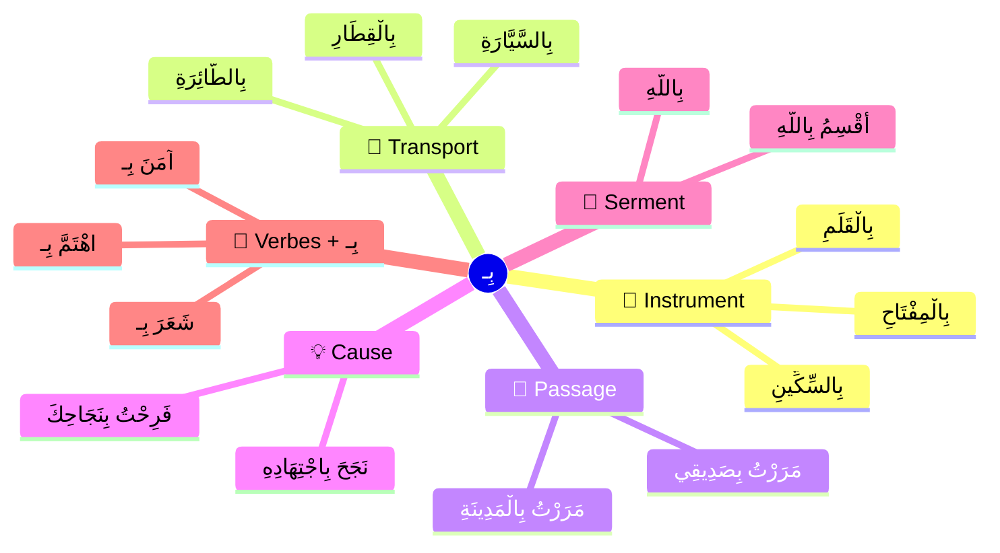

# بِـ — Avec / Par / Au moyen de

**بِـ** (al-bā') est un **حَرْفُ جَرٍّ** (préposition) qui se colle directement au mot suivant. C'est une des prépositions les plus utilisées en arabe.

> [!warning]
> ⚠️ **Règle :**
>
> **بِـ** est un **حَرْفُ جَرٍّ** → le mot après est **مَجْرُورٌ** (génitif).
>
> **بِـ** se colle au mot : بِـ + الْقَلَمِ = **بِالْقَلَمِ**

---

## 1️⃣ بِـ = avec / au moyen de (الْأَدَاةُ)

Le sens le plus courant : **l'instrument** ou le **moyen** utilisé pour faire quelque chose.

| Phrase | Traduction |
|---|---|
| كَتَبْتُ **بِالْقَلَمِ** | J'ai écrit **avec** le stylo |
| قَطَعَ الْخُبْزَ **بِالسِّكِّينِ** | Il a coupé le pain **avec** le couteau |
| أَكَلْتُ **بِالْمِلْعَقَةِ** | J'ai mangé **avec** la cuillère |
| فَتَحْتُ الْبَابَ **بِالْمِفْتَاحِ** | J'ai ouvert la porte **avec** la clé |
| ضَرَبَهُ **بِالْعَصَا** | Il l'a frappé **avec** le bâton |

> [!tip]
> 💡 **مَعَ vs بِـ :**
>
> • **مَعَ** = avec une **personne** (accompagnement) → ذَهَبْتُ **مَعَ** صَدِيقِي
> • **بِـ** = avec un **objet** (instrument) → كَتَبْتُ **بِـ**الْقَلَمِ
>
> Voir aussi : [[Ma3a - Avec]]

---

## 2️⃣ بِـ = par / en (وَسِيلَةُ النَّقْلِ)

Pour exprimer le **moyen de transport** :

| Phrase | Traduction |
|---|---|
| سَافَرْتُ **بِالطَّائِرَةِ** | J'ai voyagé **en** avion |
| ذَهَبْتُ **بِالسَّيَّارَةِ** | Je suis allé **en** voiture |
| جَاءَ **بِالْقِطَارِ** | Il est venu **en** train |
| ذَهَبْنَا **بِالْحَافِلَةِ** | Nous sommes allés **en** bus |
| رَجَعْتُ **بِالدَّرَّاجَةِ** | Je suis rentré **à** vélo |

---

## 3️⃣ بِـ = à / dans (الْمَكَانُ - passer par)

Avec le verbe **مَرَّ** (passer) et d'autres verbes de mouvement :

| Phrase | Traduction |
|---|---|
| مَرَرْتُ **بِالْمَدِينَةِ** | Je suis passé **par** la ville |
| مَرَرْتُ **بِصَدِيقِي** | Je suis passé **chez** mon ami |
| مَرَرْنَا **بِالسُّوقِ** | Nous sommes passés **par** le marché |

---

## 4️⃣ بِـ = à cause de / grâce à (السَّبَبُ)

Pour exprimer la **cause** ou la **raison** :

| Phrase | Traduction |
|---|---|
| نَجَحَ **بِاجْتِهَادِهِ** | Il a réussi **grâce à** son travail |
| فَرِحْتُ **بِنَجَاحِكَ** | Je suis content **de** ta réussite |
| تَعِبْتُ **بِسَبَبِ الْحَرِّ** | Je suis fatigué **à cause de** la chaleur |
| سَعِيدٌ **بِلِقَائِكَ** | Heureux **de** te rencontrer |

---

## 5️⃣ بِـ = le serment (الْقَسَمُ)

Pour **jurer par** quelque chose (comme وَ et تَ) :

| Phrase | Traduction |
|---|---|
| **بِاللَّهِ** عَلَيْكَ ! | **Par** Dieu, je t'en prie ! |
| أُقْسِمُ **بِاللَّهِ** | Je jure **par** Dieu |

---

## 6️⃣ بِـ = coller avec certains verbes

Certains verbes arabes **exigent** بِـ (comme en français "s'intéresser **à**", "penser **à**") :

| Verbe + بِـ | Sens | Exemple |
|---|---|---|
| آمَنَ **بِـ** | croire **en** | آمَنْتُ **بِاللَّهِ** (je crois en Dieu) |
| اهْتَمَّ **بِـ** | s'intéresser **à** | اهْتَمَّ **بِالدَّرْسِ** (il s'intéresse au cours) |
| رَحَّبَ **بِـ** | accueillir | رَحَّبَ **بِالضُّيُوفِ** (il a accueilli les invités) |
| شَعَرَ **بِـ** | sentir / ressentir | شَعَرْتُ **بِالتَّعَبِ** (j'ai senti la fatigue) |
| فَرِحَ **بِـ** | se réjouir **de** | فَرِحْتُ **بِالْخَبَرِ** (je me suis réjoui de la nouvelle) |
| مَرَّ **بِـ** | passer **par** | مَرَرْتُ **بِالْمَسْجِدِ** (je suis passé par la mosquée) |
| بَدَأَ **بِـ** | commencer **par** | بَدَأْتُ **بِالْبَسْمَلَةِ** (j'ai commencé par la basmala) |

---

## بِـ + ضَمِيرٌ — Avec les pronoms

| الضَّمِيرُ | بِـ + ضَمِيرٌ | Traduction | Exemple |
|---|---|---|---|
| أَنَا | **بِي** | avec/par moi | مَرَّ **بِي** (il est passé chez moi) |
| أَنْتَ | **بِكَ** | avec/par toi (m.) | سَعِيدٌ **بِكَ** (content de toi) |
| أَنْتِ | **بِكِ** | avec/par toi (f.) | أَهْلًا **بِكِ** (bienvenue à toi) |
| هُوَ | **بِهِ** | avec/par lui | آمَنْتُ **بِهِ** (j'ai cru en lui) |
| هِيَ | **بِهَا** | avec/par elle | فَرِحْتُ **بِهَا** (je me suis réjoui d'elle) |
| نَحْنُ | **بِنَا** | avec/par nous | مَرَّ **بِنَا** (il est passé chez nous) |
| أَنْتُمْ | **بِكُمْ** | avec/par vous | أَهْلًا **بِكُمْ** (bienvenue à vous) |
| هُمْ | **بِهِمْ** | avec/par eux | اهْتَمَّ **بِهِمْ** (il s'est occupé d'eux) |

---

## بِـ + الـ — La contraction

> [!info]
> Quand **بِـ** rencontre **الـ** (article défini), ils se collent :
>
> بِـ + الـ + قَلَمٌ = **بِالْقَلَمِ** (avec le stylo)
>
> La hamza de الـ disparaît (هَمْزَةُ وَصْلٍ).

| Séparé | Collé | Sens |
|---|---|---|
| بِـ + الْقَلَمُ | **بِالْقَلَمِ** | avec le stylo |
| بِـ + السَّيَّارَةُ | **بِالسَّيَّارَةِ** | en voiture |
| بِـ + اللَّهُ | **بِاللَّهِ** | par Dieu |
| بِـ + الْمِفْتَاحُ | **بِالْمِفْتَاحِ** | avec la clé |

---

## أَهْلًا وَسَهْلًا — L'expression avec بِـ

> [!info]
> Tu connais sûrement **أَهْلًا وَسَهْلًا** (bienvenue). On ajoute **بِـ** pour dire bienvenue **à** quelqu'un :
>
> | Expression | Traduction |
> |---|---|
> | أَهْلًا **بِكَ** | Bienvenue à toi (m.) |
> | أَهْلًا **بِكِ** | Bienvenue à toi (f.) |
> | أَهْلًا **بِكُمْ** | Bienvenue à vous |
> | مَرْحَبًا **بِكَ** | Bienvenue à toi |

---

## 🧠 Résumé des sens de بِـ

> [!tip]
> 💡 **À retenir :**
>
> **1.** بِـ est un **حَرْفُ جَرٍّ** (contrairement à مَعَ qui est un ظَرْفٌ)
> **2.** بِـ se **colle** au mot → بِالْقَلَمِ, بِكَ, بِهِ
> **3.** Sens principal : **instrument** (avec quoi ?) et **moyen** (par quoi ?)
> **4.** Beaucoup de verbes arabes **exigent** بِـ (آمَنَ بِـ, اهْتَمَّ بِـ, فَرِحَ بِـ...)
> **5.** Ne confonds pas avec [[Ma3a - Avec]] : مَعَ = accompagnement, بِـ = instrument

---

Voir aussi : [[Huruf Al-Jar - Prepositions]] · [[Ma3a - Avec]] · [[Lam Al-Jar - Li pour a]]
