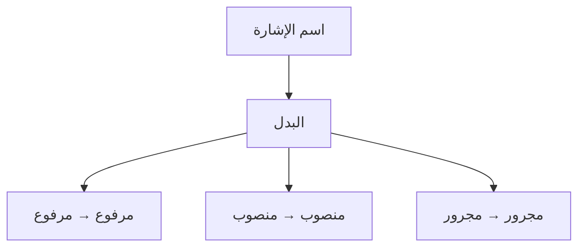

# الْبَدَلُ — Le nom après اسْمُ الْإِشَارَةِ

## مَا هُوَ الْبَدَلُ ؟ — C'est quoi ?

> [!info]
> **Définition :**
> 
> الْبَدَلُ هُوَ **الِاسْمُ الَّذِي يَأْتِي بَعْدَ [[Ism Ichara - Demonstratifs|اسْمِ الْإِشَارَةِ]]**
>
> C'est le **nom qui vient après le démonstratif** (هَذَا، هَذِهِ، ذَلِكَ، تِلْكَ...) pour préciser de quoi on parle.

> [!tip]
> 💡 **Exemple simple :**
>
> هَذَا **الْكِتَابُ** جَمِيلٌ
>
> **هَذَا** = اسْمُ الْإِشَارَةِ (démonstratif)
> **الْكِتَابُ** = الْبَدَلُ (il précise : c'est **quoi** « هَذَا » ? → c'est le livre)
>
> → « **Ce livre** est beau »

---

## الْقَاعِدَةُ — La règle

> [!warning]
> ⚠️ **Règle :**
>
> **الْبَدَلُ يَتْبَعُ الْمُبْدَلَ مِنْهُ فِي الْإِعْرَابِ**
>
> Le بَدَل prend **le même [[Revision - Grammaire Arabe|إِعْرَاب]]** que le [[Ism Ichara - Demonstratifs|اسْمُ الْإِشَارَةِ]] :
>
> • اسْمُ الْإِشَارَةِ مَرْفُوعٌ → الْبَدَلُ **مَرْفُوعٌ**
> • اسْمُ الْإِشَارَةِ مَنْصُوبٌ → الْبَدَلُ **مَنْصُوبٌ**
> • اسْمُ الْإِشَارَةِ مَجْرُورٌ → الْبَدَلُ **مَجْرُورٌ**

> [!info]
> **Comment reconnaître le بَدَل ?**
>
> Tu peux **supprimer اسْمَ الْإِشَارَةِ** et la phrase garde son sens :
>
> ~~هَذَا~~ الْكِتَابُ جَمِيلٌ → الْكِتَابُ جَمِيلٌ ✅
>
> Si la phrase marche toujours sans le démonstratif → le nom après est un **بَدَلٌ**.

---

## أَمْثِلَةٌ مَعَ هَذَا / هَذِهِ — Exemples

| Phrase                | اسْمُ الْإِشَارَةِ | الْبَدَلُ       | Traduction                  |
|---|---|---|---|
| هَذَا **الْوَلَدُ** ذَكِيٌّ     | هَذَا         | **الْوَلَدُ**   | Ce garçon est intelligent   |
| هَذِهِ **السَّيَّارَةُ** جَدِيدَةٌ | هَذِهِ         | **السَّيَّارَةُ** | Cette voiture est nouvelle  |
| هَذَا **الْمُعَلِّمُ** مُمْتَازٌ  | هَذَا         | **الْمُعَلِّمُ**  | Ce professeur est excellent |
| هَذِهِ **الْمَدْرَسَةُ** كَبِيرَةٌ | هَذِهِ         | **الْمَدْرَسَةُ** | Cette école est grande      |
| ذَلِكَ **الرَّجُلُ** طَوِيلٌ    | ذَلِكَ         | **الرَّجُلُ**   | Cet homme(-là) est grand    |
| تِلْكَ **الْبِنْتُ** جَمِيلَةٌ   | تِلْكَ         | **الْبِنْتُ**   | Cette fille(-là) est belle  |

---

## الْإِعْرَابُ فِي الْحَالَاتِ الثَّلَاثِ — Dans les 3 cas

### مَرْفُوعٌ (sujet / مُبْتَدَأٌ)

| Phrase                 | إِعْرَابُ الْبَدَلِ                                   |
|---|---|
| هَذَا **الْكِتَابُ** مُفِيدٌ    | **الْكِتَابُ** : بَدَلٌ مَرْفُوعٌ وَعَلَامَةُ رَفْعِهِ **الضَّمَّةُ**  |
| هَذِهِ **الطَّالِبَةُ** مُجْتَهِدَةٌ | **الطَّالِبَةُ** : بَدَلٌ مَرْفُوعٌ وَعَلَامَةُ رَفْعِهِ **الضَّمَّةُ** |

### مَنْصُوبٌ (complément / مَفْعُولٌ بِهِ)

| Phrase               | إِعْرَابُ الْبَدَلِ                                    |
|---|---|
| قَرَأْتُ هَذَا **الْكِتَابَ**  | **الْكِتَابَ** : بَدَلٌ مَنْصُوبٌ وَعَلَامَةُ نَصْبِهِ **الْفَتْحَةُ**  |
| رَأَيْتُ هَذِهِ **الطَّالِبَةَ** | **الطَّالِبَةَ** : بَدَلٌ مَنْصُوبٌ وَعَلَامَةُ نَصْبِهِ **الْفَتْحَةُ** |

### مَجْرُورٌ (après [[Huruf Al-Jar - Prepositions|حَرْفُ جَرٍّ]])

| Phrase                   | إِعْرَابُ الْبَدَلِ                                   |
|---|---|
| كَتَبْتُ فِي هَذَا **الْكِتَابِ**   | **الْكِتَابِ** : بَدَلٌ مَجْرُورٌ وَعَلَامَةُ جَرِّهِ **الْكَسْرَةُ**  |
| سَلَّمْتُ عَلَى هَذِهِ **الطَّالِبَةِ** | **الطَّالِبَةِ** : بَدَلٌ مَجْرُورٌ وَعَلَامَةُ جَرِّهِ **الْكَسْرَةُ** |

---

## اخْتِبَارُ الْحَذْفِ — Le test de suppression

Pour vérifier que c'est bien un بَدَل, **supprime اسْمَ الْإِشَارَةِ** :

| Avec اسْمُ الْإِشَارَةِ        | Sans اسْمُ الْإِشَارَةِ | Ça marche ?             |
|---|---|---|
| **هَذَا** الْكِتَابُ مُفِيدٌ     | الْكِتَابُ مُفِيدٌ      | ✅ Oui → الْكِتَابُ est بَدَلٌ |
| قَرَأْتُ **هَذَا** الْكِتَابَ     | قَرَأْتُ الْكِتَابَ      | ✅ Oui → الْكِتَابَ est بَدَلٌ |
| سَلَّمْتُ عَلَى **هَذَا** الْمُعَلِّمِ | سَلَّمْتُ عَلَى الْمُعَلِّمِ  | ✅ Oui → الْمُعَلِّمِ est بَدَلٌ |

---

## 🧠 Résumé

> [!warning]
> ⚠️ **Les règles à retenir :**
>
> **1.** الْبَدَلُ = le **nom (avec الْ) qui vient après اسْمُ الْإِشَارَةِ**
> هَذَا **الْكِتَابُ** / هَذِهِ **الْمَدْرَسَةُ** / ذَلِكَ **الرَّجُلُ**
>
> **2.** الْبَدَلُ يَتْبَعُ الْمُبْدَلَ مِنْهُ فِي الْإِعْرَابِ = **même cas grammatical** que le اسْمُ الْإِشَارَةِ
> مَرْفُوعٌ → مَرْفُوعٌ / مَنْصُوبٌ → مَنْصُوبٌ / مَجْرُورٌ → مَجْرُورٌ
>
> **3.** On peut **supprimer اسْمَ الْإِشَارَةِ** et la phrase reste correcte
> ~~هَذَا~~ الْكِتَابُ مُفِيدٌ → الْكِتَابُ مُفِيدٌ ✅
