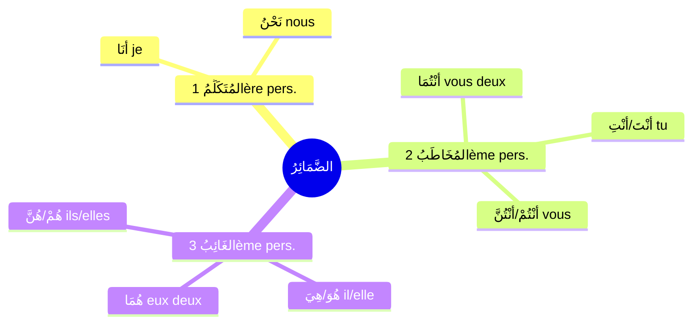

# الضَّمَائِرُ — Les pronoms personnels

Le **الضَّمِيرُ** est un **اِسْمٌ** (nom) qui remplace un nom de personne ou de chose. C'est une des **6 catégories de [[Revision - Grammaire Arabe|مَعْرِفَةٌ]]** → il est toujours **déterminé**.

> [!info]
> Les ضَمَائِرُ se classent en **3 catégories** :
>
> **1. المُتَكَلِّمُ** = celui qui parle (1ère personne)
> **2. المُخَاطَبُ** = celui à qui on parle (2ème personne)
> **3. الغَائِبُ** = celui dont on parle / l'absent (3ème personne)

---

## 1️⃣ ضَمَائِرُ المُتَكَلِّمِ — Celui qui parle (1ère personne)

| العَدَدُ | الضَّمِيرُ المُنْفَصِلُ | Traduction | الضَّمِيرُ المُتَّصِلُ | Exemple |
|---|---|---|---|---|
| **مُفْرَدٌ** (singulier) | **أَنَا** | je / moi | **ـي / ـنِي** | كِتَابِ**ي** — عَلَّمَ**نِي** |
| **جَمْعٌ** (pluriel) | **نَحْنُ** | nous | **ـنَا** | كِتَابُ**نَا** — عَلَّمَ**نَا** |

### أَمْثِلَةٌ

| Phrase         | Traduction              |
|---|---|
| **أَنَا** طَالِبٌ   | Je suis étudiant        |
| **نَحْنُ** مُسْلِمُونَ | Nous sommes musulmans   |
| هَذَا كِتَابِ**ي**  | C'est mon livre         |
| بَيْتُ**نَا** كَبِيرٌ | Notre maison est grande |

---

## 2️⃣ ضَمَائِرُ المُخَاطَبِ — Celui à qui on parle (2ème personne)

| العَدَدُ / الجِنْسُ | الضَّمِيرُ المُنْفَصِلُ | Traduction | الضَّمِيرُ المُتَّصِلُ | Exemple |
|---|---|---|---|---|
| **مُفْرَدٌ مُذَكَّرٌ** | **أَنْتَ** | tu (masc.) | **ـكَ** | كِتَابُ**كَ** — رَأَيْتُ**كَ** |
| **مُفْرَدٌ مُؤَنَّثٌ** | **أَنْتِ** | tu (fém.) | **ـكِ** | كِتَابُ**كِ** — رَأَيْتُ**كِ** |
| **مُثَنًّى** (masc. & fém.) | **أَنْتُمَا** | vous deux | **ـكُمَا** | كِتَابُ**كُمَا** |
| **جَمْعٌ مُذَكَّرٌ** | **أَنْتُمْ** | vous (masc.) | **ـكُمْ** | كِتَابُ**كُمْ** |
| **جَمْعٌ مُؤَنَّثٌ** | **أَنْتُنَّ** | vous (fém.) | **ـكُنَّ** | كِتَابُ**كُنَّ** |

### أَمْثِلَةٌ

| Phrase            | Traduction               |
|---|---|
| **أَنْتَ** مُعَلِّمٌ      | Tu es professeur (masc.) |
| **أَنْتِ** طَالِبَةٌ     | Tu es étudiante (fém.)   |
| **أَنْتُمْ** فِي البَيْتِ | Vous êtes à la maison    |
| مَا اسْمُ**كَ** ؟     | Quel est ton nom ?       |

---

## 3️⃣ ضَمَائِرُ الغَائِبِ — L'absent (3ème personne)

| العَدَدُ / الجِنْسُ | الضَّمِيرُ المُنْفَصِلُ | Traduction | الضَّمِيرُ المُتَّصِلُ | Exemple |
|---|---|---|---|---|
| **مُفْرَدٌ مُذَكَّرٌ** | **هُوَ** | il / lui | **ـهُ** | كِتَابُ**هُ** — رَأَيْتُ**هُ** |
| **مُفْرَدٌ مُؤَنَّثٌ** | **هِيَ** | elle | **ـهَا** | كِتَابُ**هَا** — رَأَيْتُ**هَا** |
| **مُثَنًّى** (masc. & fém.) | **هُمَا** | eux/elles deux | **ـهُمَا** | كِتَابُ**هُمَا** |
| **جَمْعٌ مُذَكَّرٌ** | **هُمْ** | ils / eux | **ـهُمْ** | كِتَابُ**هُمْ** — رَأَيْتُ**هُمْ** |
| **جَمْعٌ مُؤَنَّثٌ** | **هُنَّ** | elles | **ـهُنَّ** | كِتَابُ**هُنَّ** |

> [!warning]
> ⚠️ **هُمْ** = ضَمِيرُ **جَمْعِ المُذَكَّرِ الغَائِبِ العَاقِلِ**
>
> • **ضَمِيرٌ** = pronom
> • **جَمْعٌ** = pluriel
> • **المُذَكَّرُ** = masculin
> • **الغَائِبُ** = 3ème personne (absent)
> • **العَاقِلُ** = rationnel (humains)

### أَمْثِلَةٌ

| Phrase             | Traduction                |
|---|---|
| **هُوَ** طَبِيبٌ        | Il est médecin            |
| **هِيَ** مُهَنْدِسَةٌ      | Elle est ingénieure       |
| **هُمْ** فِي المَدْرَسَةِ  | Ils sont à l'école        |
| رَأَيْتُ**هُ**          | Je l'ai vu                |
| أَعْطَيْتُ**هُمْ** الكِتَابَ | Je leur ai donné le livre |

---

## 🧠 Résumé

<table style="width:100%;">
<colgroup>
<col style="width: 16%" />
<col style="width: 16%" />
<col style="width: 16%" />
<col style="width: 16%" />
<col style="width: 16%" />
<col style="width: 16%" />
</colgroup>
<thead>
<tr>
<th></th>
<th>مُفْرَدٌ مُذَكَّرٌ</th>
<th>مُفْرَدٌ مُؤَنَّثٌ</th>
<th>مُثَنًّى</th>
<th>جَمْعٌ مُذَكَّرٌ</th>
<th>جَمْعٌ مُؤَنَّثٌ</th>
</tr>
</thead>
<tbody>
<tr>
<td><strong>المُتَكَلِّمُ</strong> 
(1ère pers.)</td>
<td colspan="2" class="big"><strong>أَنَا</strong></td>
<td colspan="3" class="big"><strong>نَحْنُ</strong></td>
</tr>
<tr>
<td><strong>المُخَاطَبُ</strong> 
(2ème pers.)</td>
<td class="big"><strong>أَنْتَ</strong></td>
<td class="big"><strong>أَنْتِ</strong></td>
<td class="big"><strong>أَنْتُمَا</strong></td>
<td class="big"><strong>أَنْتُمْ</strong></td>
<td class="big"><strong>أَنْتُنَّ</strong></td>
</tr>
<tr>
<td><strong>الغَائِبُ</strong> 
(3ème pers.)</td>
<td class="big"><strong>هُوَ</strong></td>
<td class="big"><strong>هِيَ</strong></td>
<td class="big"><strong>هُمَا</strong></td>
<td class="big"><strong>هُمْ</strong></td>
<td class="big"><strong>هُنَّ</strong></td>
</tr>
</tbody>
</table>

> [!tip]
> 💡 **À retenir :**
>
> • الضَّمِيرُ est toujours **مَعْرِفَةٌ** (déterminé) — c'est une des 6 catégories de [[Revision - Grammaire Arabe|مَعْرِفَةٌ]]
>
> • **ضَمِيرٌ مُنْفَصِلٌ** = mot séparé (أَنَا، هُوَ...)
> • **ضَمِيرٌ مُتَّصِلٌ** = collé à un autre mot (كِتَابِـي، رَأَيْتُـهُ...)
