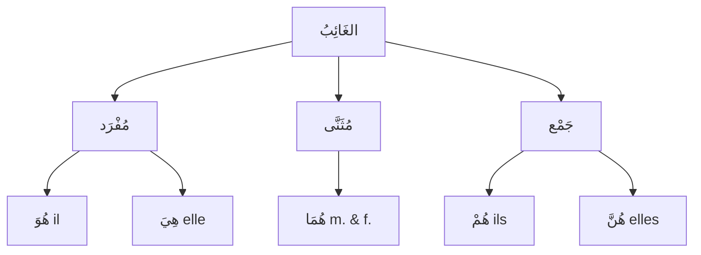

# ضَمَائِرُ الغَائِبِ — L'absent (3ème personne)

Voir aussi : [[Damaair - Les pronoms]] · [[Damaair Al-Mutakallim - 1ere personne]] · [[Damaair Al-Mukhatab - 2eme personne]]

---

## Qui est الغَائِبُ ?

> [!info]
> **الغَائِبُ** = **celui dont on parle / l'absent**. On parle de quelqu'un qui n'est **pas présent** dans la conversation. Comme le المُخَاطَبُ, il distingue le **genre** et le **nombre** → **5 pronoms**.

---

## Les 5 pronoms séparés (مُنْفَصِل)

| الضَّمِيرُ | العَدَدُ / الجِنْسُ | Traduction |
|---|---|---|
| **هُوَ** | مُفْرَد مُذَكَّر | il / lui |
| **هِيَ** | مُفْرَد مُؤَنَّث | elle |
| **هُمَا** | مُثَنَّى (m. & f.) | eux/elles deux |
| **هُمْ** | جَمْع مُذَكَّر | ils / eux |
| **هُنَّ** | جَمْع مُؤَنَّث | elles |

---

## Les pronoms attachés (مُتَّصِل) du الغَائِبِ

| الضَّمِيرُ المُتَّصِلُ | Pour qui       | Après un اسْم              | Après un فِعْل                |
| ---------------------- | -------------- | -------------------------- | ----------------------------- |
| **ـهُ**                | lui            | كِتَابُ**هُ** = son livre  | رَأَيْتُ**هُ** = je l'ai vu   |
| **ـهَا**               | elle           | كِتَابُ**هَا** = son livre | رَأَيْتُ**هَا** = je l'ai vue |
| **ـهُمَا**             | eux/elles deux | كِتَابُ**هُمَا**           | رَأَيْتُ**هُمَا**             |
| **ـهُمْ**              | eux            | كِتَابُ**هُمْ**            | رَأَيْتُ**هُمْ**              |
| **ـهُنَّ**             | elles          | كِتَابُ**هُنَّ**           | رَأَيْتُ**هُنَّ**             |

---

## Le piège majeur : جَمْعُ غَيْرِ العَاقِلِ

> [!warning]
> **Règle cruciale :**
>
> Le **pluriel des choses** (غَيْرُ عَاقِلٍ = non-rationnel) est traité comme **مُفْرَد مُؤَنَّث**.
>
> On utilise **هِيَ** (pas هُمْ ni هُنَّ) pour les choses au pluriel !

| Mot | عَاقِل ? | Pronom | Exemple |
|---|---|---|---|
| الرِّجَالُ (les hommes) | عَاقِل | **هُمْ** | **هُمْ** أَطِبَّاءُ |
| النِّسَاءُ (les femmes) | عَاقِل | **هُنَّ** | **هُنَّ** مُعَلِّمَاتٌ |
| الكُتُبُ (les livres) | غَيْرُ عَاقِلٍ | **هِيَ** | **هِيَ** مُفِيدَةٌ |
| السَّيَّارَاتُ (les voitures) | غَيْرُ عَاقِلٍ | **هِيَ** | **هِيَ** جَدِيدَةٌ |
| الأَقْلَامُ (les stylos) | غَيْرُ عَاقِلٍ | **هِيَ** | **هِيَ** كَثِيرَةٌ |

> [!tip]
> **Comment savoir ?** Pose-toi la question : est-ce que c'est un **humain** ?
> - Oui → عَاقِل → هُمْ / هُنَّ
> - Non → غَيْرُ عَاقِلٍ → **هِيَ** (toujours !)

---

## Le verbe s'accorde avec الغَائِبِ

| الضَّمِيرُ | الفِعْلُ المُضَارِعُ (présent) | الفِعْلُ المَاضِي (passé) |
|---|---|---|
| هُوَ | **يَـ**ـكْتُبُ | كَتَبَ |
| هِيَ | **تَـ**ـكْتُبُ | كَتَبَ**تْ** |
| هُمَا (m.) | **يَـ**ـكْتُبَـ**انِ** | كَتَبَ**ا** |
| هُمَا (f.) | **تَـ**ـكْتُبَـ**انِ** | كَتَبَ**تَا** |
| هُمْ | **يَـ**ـكْتُبُ**ونَ** | كَتَبُ**وا** |
| هُنَّ | **يَـ**ـكْتُبْ**نَ** | كَتَبْ**نَ** |

> [!tip]
> Au **مُضَارِع** :
> - المُذَكَّرُ الغَائِبُ commence par **يَـ** (ya-)
> - المُؤَنَّثُ الغَائِبُ commence par **تَـ** (ta-)

---

## Exemples en situation

### Parler d'un homme (هُوَ)

| Phrase | Traduction |
|---|---|
| **هُوَ** طَبِيبٌ | Il est médecin |
| **هُوَ** يَدْرُسُ فِي الجَامِعَةِ | Il étudie à l'université |
| كِتَابُ**هُ** عَلَى الطَّاوِلَةِ | Son livre est sur la table |

### Parler d'une femme (هِيَ)

| Phrase | Traduction |
|---|---|
| **هِيَ** مُعَلِّمَةٌ | Elle est enseignante |
| **هِيَ** تَعْمَلُ فِي المُسْتَشْفَى | Elle travaille à l'hôpital |
| بَيْتُ**هَا** كَبِيرٌ | Sa maison est grande |

### Parler de choses (جَمْعُ غَيْرِ العَاقِلِ → هِيَ)

| Phrase | Traduction |
|---|---|
| الكُتُبُ... **هِيَ** مُفِيدَةٌ | Les livres... ils (= elles) sont utiles |
| السَّيَّارَاتُ... **هِيَ** غَالِيَةٌ | Les voitures... elles sont chères |
| هَذِهِ الأَقْلَامُ... **هِيَ** جَدِيدَةٌ | Ces stylos... ils (= elles) sont neufs |

---

## 🧠 Résumé

> [!warning]
> **الغَائِبُ = celui dont on parle (l'absent)**
>
> | | مُنْفَصِل | مُتَّصِل |
> |---|---|---|
> | مُفْرَد مُذَكَّر | هُوَ | ـهُ |
> | مُفْرَد مُؤَنَّث | هِيَ | ـهَا |
> | مُثَنَّى | هُمَا | ـهُمَا |
> | جَمْع مُذَكَّر | هُمْ | ـهُمْ |
> | جَمْع مُؤَنَّث | هُنَّ | ـهُنَّ |
>
> **Le piège :** pluriel de choses (غَيْرُ عَاقِلٍ) → toujours **هِيَ** !
