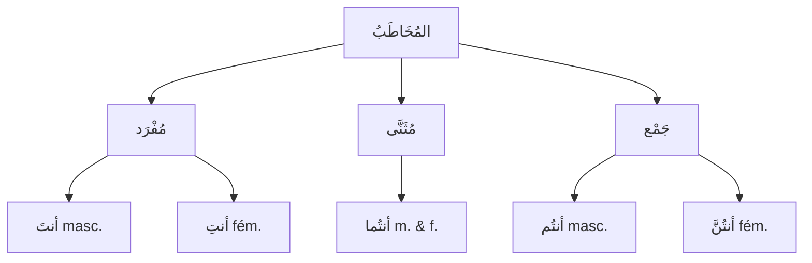

# ضَمَائِرُ المُخَاطَبِ — Celui à qui on parle (2ème personne)

Voir aussi : [[Damaair - Les pronoms]] · [[Damaair Al-Mutakallim - 1ere personne]] · [[Damaair Al-Ghaib - 3eme personne]]

---

## Qui est المُخَاطَبُ ?

> [!info]
> **المُخَاطَبُ** = **celui à qui on parle** (l'interlocuteur). C'est la catégorie la plus riche : **5 pronoms** car on distingue le **genre** (مُذَكَّر/مُؤَنَّث) et le **nombre** (مُفْرَد/مُثَنَّى/جَمْع).

---

## Les 5 pronoms séparés (مُنْفَصِل)

| الضَّمِيرُ | العَدَدُ / الجِنْسُ | Traduction | Voyelle finale |
|---|---|---|---|
| **أَنْتَ** | مُفْرَد مُذَكَّر | tu (masc.) | فَتْحَة = **تَ** |
| **أَنْتِ** | مُفْرَد مُؤَنَّث | tu (fém.) | كَسْرَة = **تِ** |
| **أَنْتُمَا** | مُثَنَّى (m. & f.) | vous deux | |
| **أَنْتُمْ** | جَمْع مُذَكَّر | vous (masc.) | |
| **أَنْتُنَّ** | جَمْع مُؤَنَّث | vous (fém.) | |

> [!warning]
> **Le piège أَنْتَ / أَنْتِ :**
> La seule différence c'est la voyelle finale !
> - **أَنْتَ** (fatha) = à un **garçon/homme**
> - **أَنْتِ** (kasra) = à une **fille/femme**
>
> À l'oral c'est différent. À l'écrit sans tashkīl, c'est le même mot → le contexte tranche.

---

## Les pronoms attachés (مُتَّصِل) du المُخَاطَبِ

| الضَّمِيرُ المُتَّصِلُ | Pour qui | Après un اسْم | Après un فِعْل |
|---|---|---|---|
| **ـكَ** | toi (masc.) | كِتَابُ**كَ** = ton livre | رَأَيْتُ**كَ** = je t'ai vu |
| **ـكِ** | toi (fém.) | كِتَابُ**كِ** = ton livre | رَأَيْتُ**كِ** = je t'ai vue |
| **ـكُمَا** | vous deux | كِتَابُ**كُمَا** | رَأَيْتُ**كُمَا** |
| **ـكُمْ** | vous (masc.) | كِتَابُ**كُمْ** | رَأَيْتُ**كُمْ** |
| **ـكُنَّ** | vous (fém.) | كِتَابُ**كُنَّ** | رَأَيْتُ**كُنَّ** |

> [!tip]
> Même logique que le مُنْفَصِل : **كَ** (fatha) = masculin, **كِ** (kasra) = féminin.

---

## Exemples en situation

### S'adresser à un homme (أَنْتَ)

| Phrase | Traduction |
|---|---|
| **أَنْتَ** طَالِبٌ | Tu es étudiant |
| مَا اسْمُ**كَ** ؟ | Quel est ton nom ? |
| أَيْنَ بَيْتُ**كَ** ؟ | Où est ta maison ? |
| هَلْ **عِنْدَكَ** كِتَابٌ ؟ | As-tu un livre ? |

### S'adresser à une femme (أَنْتِ)

| Phrase | Traduction |
|---|---|
| **أَنْتِ** طَالِبَةٌ | Tu es étudiante |
| مَا اسْمُ**كِ** ؟ | Quel est ton nom ? |
| أَيْنَ بَيْتُ**كِ** ؟ | Où est ta maison ? |
| هَلْ **عِنْدَكِ** كِتَابٌ ؟ | As-tu un livre ? |

### S'adresser à deux personnes (أَنْتُمَا)

| Phrase | Traduction |
|---|---|
| **أَنْتُمَا** طَالِبَانِ | Vous deux êtes étudiants |
| اذْهَبَا إِلَى البَيْتِ | Allez (tous les deux) à la maison |

### S'adresser à un groupe (أَنْتُمْ / أَنْتُنَّ)

| Phrase | Traduction |
|---|---|
| **أَنْتُمْ** فِي الفَصْلِ | Vous êtes en classe (masc.) |
| **أَنْتُنَّ** مُجْتَهِدَاتٌ | Vous êtes studieuses (fém.) |
| أَيْنَ كُتُبُ**كُمْ** ؟ | Où sont vos livres ? |

---

## Le verbe s'accorde avec المُخَاطَبِ

Quand on utilise un pronom du المُخَاطَبِ, le verbe change aussi :

| الضَّمِيرُ | الفِعْلُ المُضَارِعُ (présent) | الفِعْلُ المَاضِي (passé) |
|---|---|---|
| أَنْتَ | **تَـ**ـكْتُبُ | كَتَبْ**تَ** |
| أَنْتِ | **تَـ**ـكْتُبِ**ينَ** | كَتَبْ**تِ** |
| أَنْتُمَا | **تَـ**ـكْتُبَـ**انِ** | كَتَبْ**تُمَا** |
| أَنْتُمْ | **تَـ**ـكْتُبُ**ونَ** | كَتَبْ**تُمْ** |
| أَنْتُنَّ | **تَـ**ـكْتُبْ**نَ** | كَتَبْ**تُنَّ** |

> [!tip]
> Au **مُضَارِع** : tous les pronoms du المُخَاطَبِ commencent par **تَـ** (ta-).

---

## 🧠 Résumé

> [!warning]
> **المُخَاطَبُ = celui à qui on parle**
>
> | | مُنْفَصِل | مُتَّصِل |
> |---|---|---|
> | مُفْرَد مُذَكَّر | أَنْتَ | ـكَ |
> | مُفْرَد مُؤَنَّث | أَنْتِ | ـكِ |
> | مُثَنَّى | أَنْتُمَا | ـكُمَا |
> | جَمْع مُذَكَّر | أَنْتُمْ | ـكُمْ |
> | جَمْع مُؤَنَّث | أَنْتُنَّ | ـكُنَّ |
>
> **Astuce :** فَتْحَة (ـَ) = مُذَكَّر · كَسْرَة (ـِ) = مُؤَنَّث
