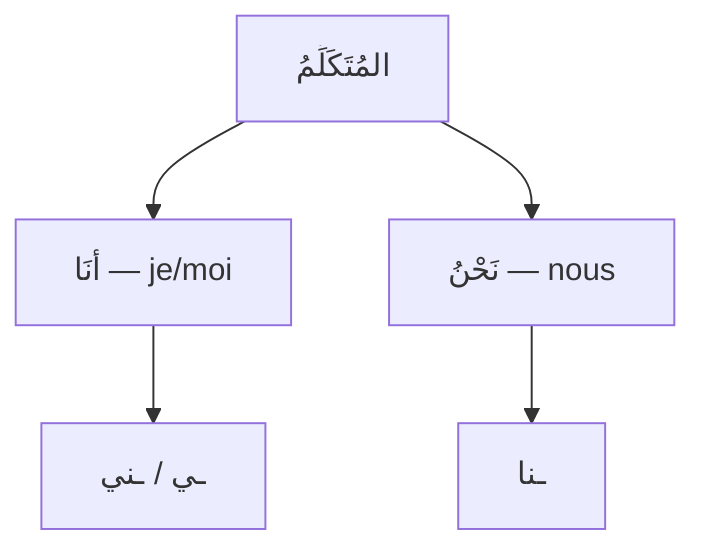

# ضَمَائِرُ المُتَكَلِّمِ — Celui qui parle (1ère personne)

Voir aussi : [[Damaair - Les pronoms]] · [[Damaair Al-Mukhatab - 2eme personne]] · [[Damaair Al-Ghaib - 3eme personne]]

---

## Qui est المُتَكَلِّمُ ?

> [!info]
> **المُتَكَلِّمُ** = **celui qui parle**. Il n'y a que **2 pronoms** car celui qui parle ne distingue pas le genre (je = je, que tu sois homme ou femme).

---

## Les 2 pronoms séparés (مُنْفَصِل)

| الضَّمِيرُ | Traduction | Nombre |
|---|---|---|
| **أَنَا** | je / moi | مُفْرَد (singulier) |
| **نَحْنُ** | nous | جَمْع (pluriel) |

> [!tip]
> **أَنَا** sert pour le masculin ET le féminin. Pas de أَنَا مُذَكَّر / أَنَا مُؤَنَّث !

### Exemples en phrase nominale (جُمْلَة اسْمِيَّة)

| Phrase | Traduction | Analyse |
|---|---|---|
| **أَنَا** طَالِبٌ | Je suis étudiant | أَنَا = مُبْتَدَأ, طَالِبٌ = خَبَر |
| **أَنَا** طَالِبَةٌ | Je suis étudiante | même structure, seul le خَبَر change |
| **نَحْنُ** مُسْلِمُونَ | Nous sommes musulmans | نَحْنُ = مُبْتَدَأ |
| **نَحْنُ** فِي البَيْتِ | Nous sommes à la maison | |

### Exemples avec un verbe (جُمْلَة فِعْلِيَّة)

| Phrase | Traduction |
|---|---|
| **أَنَا** أَدْرُسُ | Moi, j'étudie |
| **نَحْنُ** نَذْهَبُ إِلَى المَدْرَسَةِ | Nous allons à l'école |

---

## Les pronoms attachés (مُتَّصِل) du المُتَكَلِّمِ

| الضَّمِيرُ المُتَّصِلُ | Signification | Position | Exemple |
|---|---|---|---|
| **ـي** | mon / me | après un اسْم ou un حَرْف | كِتَابِ**ي** = mon livre · لِ**ي** = pour moi |
| **ـنِي** | me | après un فِعْل | عَلَّمَ**نِي** = il m'a enseigné |
| **ـنَا** | notre / nous | partout | كِتَابُ**نَا** = notre livre · عَلَّمَ**نَا** = il nous a enseignés |

> [!warning]
> **ـي ou ـنِي ?**
> - Après un **اسْم** (nom) → **ـي** : كِتَابِ**ي** (mon livre)
> - Après un **فِعْل** (verbe) → **ـنِي** : عَلَّمَ**نِي** (il m'a enseigné)
> - Après un **حَرْف** (particule) → **ـي** : لِ**ي** (pour moi), عِنْدِ**ي** (chez moi)
>
> Exception : **إِنَّ** → إِنَّ**نِي** (avec نِي)

---

## Cas pratiques courants

### Exprimer la possession avec [[3inda - Chez Avoir|عِندَ]]

| Phrase | Traduction |
|---|---|
| **عِنْدِي** كِتَابٌ | J'ai un livre |
| **عِنْدَنَا** سَيَّارَةٌ | Nous avons une voiture |
| مَا **عِنْدِي** شَيْءٌ | Je n'ai rien |

### Exprimer l'accompagnement avec [[Ma3a - Avec|مَعَ]]

| Phrase | Traduction |
|---|---|
| الكِتَابُ **مَعِي** | Le livre est avec moi |
| هُمْ **مَعَنَا** | Ils sont avec nous |

### Se présenter

| Phrase | Traduction |
|---|---|
| **أَنَا** اسْمِ**ي** أَحْمَدُ | Moi, mon nom est Ahmed |
| **نَحْنُ** مِنَ المَغْرِبِ | Nous sommes du Maroc |
| **أَنَا** أُحِبُّ اللُّغَةَ العَرَبِيَّةَ | J'aime la langue arabe |

---

## 🧠 Résumé

> [!tip]
> **المُتَكَلِّمُ = celui qui parle**
>
> | | مُنْفَصِل | مُتَّصِل (اسْم/حَرْف) | مُتَّصِل (فِعْل) |
> |---|---|---|---|
> | **مُفْرَد** | أَنَا | ـي | ـنِي |
> | **جَمْع** | نَحْنُ | ـنَا | ـنَا |
>
> - Pas de distinction مُذَكَّر/مُؤَنَّث au المُتَكَلِّمِ
> - **ـي** après اسْم/حَرْف, **ـنِي** après فِعْل
