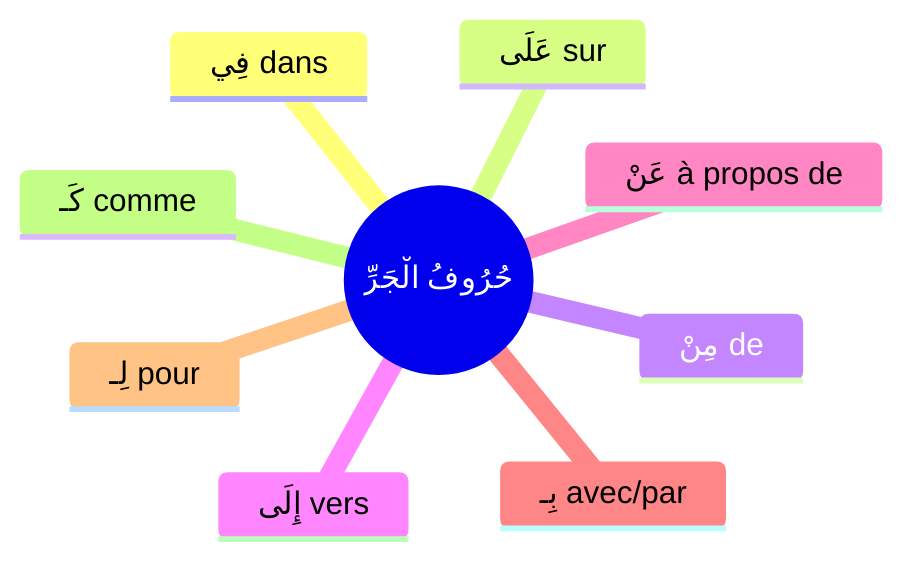

# حُرُوفُ الْجَرِّ — Les prépositions

Les **حُرُوفُ الْجَرِّ** sont des **حُرُوف** (particules) qui se placent avant un **اسْم** et le rendent **[[Revision - Grammaire Arabe|مَجْرُور]]** (avec كَسْرَة ou son équivalent).

> [!warning]
> ⚠️ **Règle importante :** Tout اسْم qui vient après un حَرْفُ جَرٍّ est **مَجْرُور**.
> فِي **الْبَيْتِ** → الْبَيْت est مَجْرُور بِالْكَسْرَةِ car il vient après فِي

---

## Tableau des حُرُوفُ الْجَرِّ

| حَرْفُ الْجَرِّ | Traduction       | Exemple     | Traduction        |
|---|---|---|---|
| **فِي**   | dans             | فِي الْبَيْتِ    | dans la maison    |
| **عَلَى**  | sur              | عَلَى الطَّاوِلَةِ | sur la table      |
| **مِنْ**   | de / depuis      | مِنَ الْمَدْرَسَةِ  | de l'école        |
| **إِلَى**  | vers / à         | إِلَى الْمَسْجِدِ  | vers la mosquée   |
| **بِـ**   | avec / par       | بِالْقَلَمِ      | avec le stylo     |
| **لِـ**   | pour / à         | لِلطَّالِبِ      | pour l'étudiant   |
| **عَنْ**   | de / à propos de | عَنِ الدَّرْسِ    | à propos du cours |
| **كَـ**   | comme            | كَالْأَسَدِ      | comme le lion     |
| **حَتَّى**  | jusqu'à          | حَتَّى الصَّبَاحِ  | jusqu'au matin    |
| **مُنْذُ**  | depuis           | مُنْذُ يَوْمَيْنِ   | depuis deux jours |

---

## فِي — dans

> [!info]
> **فِي** = pour indiquer **le lieu** (où on est) ou **le temps** (quand).

| Phrase         | Traduction                   |
|---|---|
| الْوَلَدُ فِي الْبَيْتِ | Le garçon est dans la maison |
| فِي الصَّبَاحِ      | Le matin                     |
| أَنَا فِي الْمَدْرَسَةِ | Je suis à l'école            |

---

## عَلَى — sur

> [!info]
> **عَلَى** = pour indiquer **la surface** ou **l'obligation**.

| Phrase             | Traduction                |
|---|---|
| الْكِتَابُ عَلَى الطَّاوِلَةِ | Le livre est sur la table |
| سَلَّمْتُ عَلَى الْمُعَلِّمِ    | J'ai salué le professeur  |
| عَلَيْكَ أَنْ تَدْرُسَ       | Tu dois étudier           |

---

## مِنْ — de / depuis

> [!info]
> **مِنْ** = pour indiquer **l'origine**, le **point de départ** ou une **partie** de quelque chose.

| Phrase        | Traduction                 |
|---|---|
| أَنَا مِنْ بَارِيسَ  | Je suis de Paris           |
| خَرَجْتُ مِنَ الْبَيْتِ | Je suis sorti de la maison |
| كَثِيرٌ مِنَ النَّاسِ | Beaucoup de gens           |

---

## إِلَى — vers / à

> [!info]
> **إِلَى** = pour indiquer **la destination**, le **point d'arrivée**.

| Phrase               | Traduction                |
|---|---|
| ذَهَبْتُ إِلَى الْمَسْجِدِ      | Je suis allé à la mosquée |
| مِنَ الْبَيْتِ إِلَى الْمَدْرَسَةِ | De la maison à l'école    |
| اُنْظُرْ إِلَى السَّمَاءِ      | Regarde vers le ciel      |

---

## بِـ — avec / par

> [!info]
> **بِـ** (الْبَاء) = pour indiquer **l'instrument**, le **moyen** ou **l'accompagnement**.
> Se colle directement au mot qui suit.

| Phrase       | Traduction                   |
|---|---|
| كَتَبْتُ بِالْقَلَمِ  | J'ai écrit avec le stylo     |
| بِسْمِ اللَّهِ     | Au nom d'Allah               |
| مَرَرْتُ بِالْمَسْجِدِ | Je suis passé par la mosquée |

---

## لِـ — pour / à

> [!info]
> **لِـ** (اللَّام) = pour indiquer **la possession**, le **but** ou le **destinataire**.
> Se colle directement au mot qui suit.

| Phrase        | Traduction                   |
|---|---|
| الْكِتَابُ لِلطَّالِبِ | Le livre est pour l'étudiant |
| لِلَّهِ الْحَمْدُ     | La louange est à Allah       |
| هَذَا لَكَ        | C'est pour toi               |

---

## عَنْ — de / à propos de

> [!info]
> **عَنْ** = pour indiquer **le sujet** dont on parle ou **l'éloignement**.

| Phrase         | Traduction                     |
|---|---|
| سَأَلْتُ عَنِ الدَّرْسِ  | J'ai demandé à propos du cours |
| اِبْتَعِدْ عَنِ النَّارِ | Éloigne-toi du feu             |

---

## 🧠 Résumé

| حَرْفُ الْجَرِّ | Traduction       | Exemple rapide |
|---|---|---|
| **فِي**   | dans             | فِي الْبَيْتِ       |
| **عَلَى**  | sur              | عَلَى الطَّاوِلَةِ    |
| **مِنْ**   | de / depuis      | مِنَ الْمَدْرَسَةِ     |
| **إِلَى**  | vers / à         | إِلَى الْمَسْجِدِ     |
| **بِـ**   | avec / par       | بِالْقَلَمِ         |
| **لِـ**   | pour / à         | لِلطَّالِبِ         |
| **عَنْ**   | de / à propos de | عَنِ الدَّرْسِ       |
| **كَـ**   | comme            | كَالْأَسَدِ         |
| **حَتَّى**  | jusqu'à          | حَتَّى الصَّبَاحِ     |
| **مُنْذُ**  | depuis           | مُنْذُ يَوْمَيْنِ      |

> [!tip]
> 💡 **Rappel :** Tout اسْم après un حَرْفُ جَرٍّ devient **[[Revision - Grammaire Arabe|مَجْرُور]]** (كَسْرَة ou son équivalent selon la catégorie du اسْم). Voir aussi [[Mamnu min Sarf - Interdit de tanwin|الْمَمْنُوعُ مِنَ الصَّرْفِ]] pour les cas particuliers.
