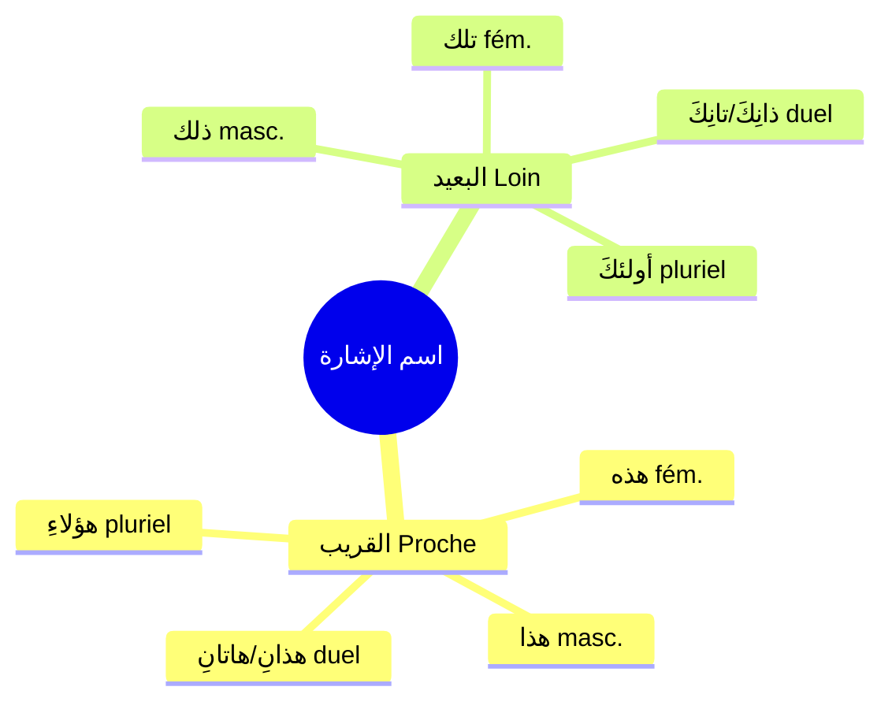

# اسم الإشارة — Le nom démonstratif

Le **اسم الإشارة** fait partie des **اسم** (noms). C'est un mot qui sert à **montrer / désigner** quelque chose ou quelqu'un.

> [!tip]
> 💡 **C'est une des 6 catégories de [[Revision - Grammaire Arabe|معرفة]] (Maʿrifa)** → il est toujours **déterminé**.

---

## 📌 Tableau des démonstratifs

### 🟢 Proche (القريب)

| Genre / Nombre | النوع | اسم الإشارة | Traduction | Exemple |
|---|---|---|---|---|
| **Masculin singulier** | المفرد المذكر القريب | **هذا** | celui-ci / ce | هذا كتابٌ = c'est un livre |
| **Féminin singulier** | المفرد المؤنث القريب | **هذه** | celle-ci / cette | هذه سيارةٌ = c'est une voiture |
| **Duel masculin** | المثنى المذكر القريب | **هذانِ** | ces deux (masc.) | هذانِ رجلانِ = ce sont deux hommes |
| **Duel féminin** | المثنى المؤنث القريب | **هاتانِ** | ces deux (fém.) | هاتانِ سيارتانِ = ce sont deux voitures |
| **Pluriel (masc. & fém.)** | الجمع القريب | **هؤلاءِ** | ceux-ci / celles-ci | هؤلاءِ رجالٌ = ce sont des hommes |

### 🔴 Loin (البعيد)

| Genre / Nombre | النوع | اسم الإشارة | Traduction | Exemple |
|---|---|---|---|---|
| **Masculin singulier** | المفرد المذكر البعيد | **ذلك** | celui-là / ce ... là | ذلك كتابٌ = c'est un livre (là-bas) |
| **Féminin singulier** | المفرد المؤنث البعيد | **تلك** | celle-là / cette ... là | تلك سيارةٌ = c'est une voiture (là-bas) |
| **Duel masculin** | المثنى المذكر البعيد | **ذانِكَ** | ces deux-là (masc.) | ذانِكَ رجلانِ = ce sont deux hommes (là-bas) |
| **Duel féminin** | المثنى المؤنث البعيد | **تانِكَ** | ces deux-là (fém.) | تانِكَ سيارتانِ = ce sont deux voitures (là-bas) |
| **Pluriel (masc. & fém.)** | الجمع البعيد | **أولئكَ** | ceux-là / celles-là | أولئكَ رجالٌ = ce sont des hommes (là-bas) |

---

## 🧠 Résumé rapide

|                 | Proche (القريب) | Loin (البعيد) |
|---|---|---|
| **Masc. sing.** | **هذا**         | **ذلك**       |
| **Fém. sing.**  | **هذه**         | **تلك**       |
| **Duel masc.**  | **هذانِ**        | **ذانِكَ**      |
| **Duel fém.**   | **هاتانِ**       | **تانِكَ**      |
| **Pluriel**     | **هؤلاءِ**       | **أولئكَ**     |

---

## هذا — En détail

> [!info]
> **هذا** = اسم إشارة للمفرد المذكر القريب
> 
> = Démonstratif pour le **singulier masculin proche**
> 
> C'est le plus utilisé. Il sert à montrer quelque chose de **proche** et de **masculin**.

### Exemples avec هذا

| Phrase          | Traduction              |
|---|---|
| هذا كتابٌ        | C'est un livre          |
| هذا رجلٌ         | C'est un homme          |
| هذا بابٌ         | C'est une porte         |
| هذا الكتابُ جميلٌ | Ce livre est beau       |
| هذا طالبٌ مجتهدٌ  | C'est un élève studieux |

> [!tip]
> 💡 **Rappel :** هذا est **معرفة** (déterminé) → on ne peut pas dire الهذا ❌
> C'est pour ça qu'il fait partie des 6 catégories de معرفة.

---

## الإشارة إلى جمع غير العاقل — Démonstratif pour le pluriel non rationnel

> [!warning]
> ⚠️ **Règle très importante :**
> 
> Le **جمع غير العاقل** (pluriel des choses / non rationnels) se traite comme un **مفرد مؤنث** !
> 
> On utilise **هذه** (pas هؤلاء) et **تلك** (pas أولئك).

### القريب — Proche (هذه)

الجمعُ غيرُ العاقل للقريب (**هذه**) :

| Phrase                 | Traduction               |
|---|---|
| **هذه** كتبٌ            | Ce sont des livres       |
| **هذه** بيوتٌ           | Ce sont des maisons      |
| **هذه** الأبوابُ مفتوحةٌ | Ces portes sont ouvertes |
| **هذه** الدروسُ سهلةٌ    | Ces leçons sont faciles  |

### البعيد — Loin (تلك)

الجمعُ غيرُ العاقل للبعيد (**تلك**) :

| Phrase                 | Traduction                         |
|---|---|
| **تلك** كتبٌ            | Ce sont des livres (là-bas)        |
| **تلك** بيوتٌ           | Ce sont des maisons (là-bas)       |
| **تلك** النوافذُ مُغلَقةٌ  | Ces fenêtres (là-bas) sont fermées |
| **تلك** الطائراتُ كبيرةٌ | Ces avions (là-bas) sont grands    |

### Ce qui est CORRECT et INCORRECT

| ✅ Correct     | ❌ Incorrect | ❌ Incorrect |
|---|---|---|
| **هذه** كتبٌ ✅ | هذا كتبٌ ❌   | هؤلاء كتبٌ ❌ |
| **تلك** كتبٌ ✅ | ذلك كتبٌ ❌   | أولئك كتبٌ ❌ |

> [!tip]
> 💡 **Pourquoi ?**
> 
> • **هؤلاء** et **أولئك** = seulement pour le **جمع العاقل** (pluriel d'humains)
> → هؤلاءِ رجالٌ ✅ (des hommes = عاقل)
> 
> • **هذه** et **تلك** = pour le **جمع غير العاقل** (pluriel de choses)
> → هذه كتبٌ ✅ (des livres = غير عاقل)

### الإعراب — Analyse grammaticale

| Phrase                 | هذه / تلك | الاسم   | الخبر   |
|---|---|---|---|
| **هذه الأبوابُ مفتوحةٌ** | **مبتدأ** | **[[Badal - La substitution\|بدل]]** | **خبر** |
| **تلك النوافذُ مُغلَقةٌ**  | **مبتدأ** | **[[Badal - La substitution\|بدل]]** | **خبر** |
