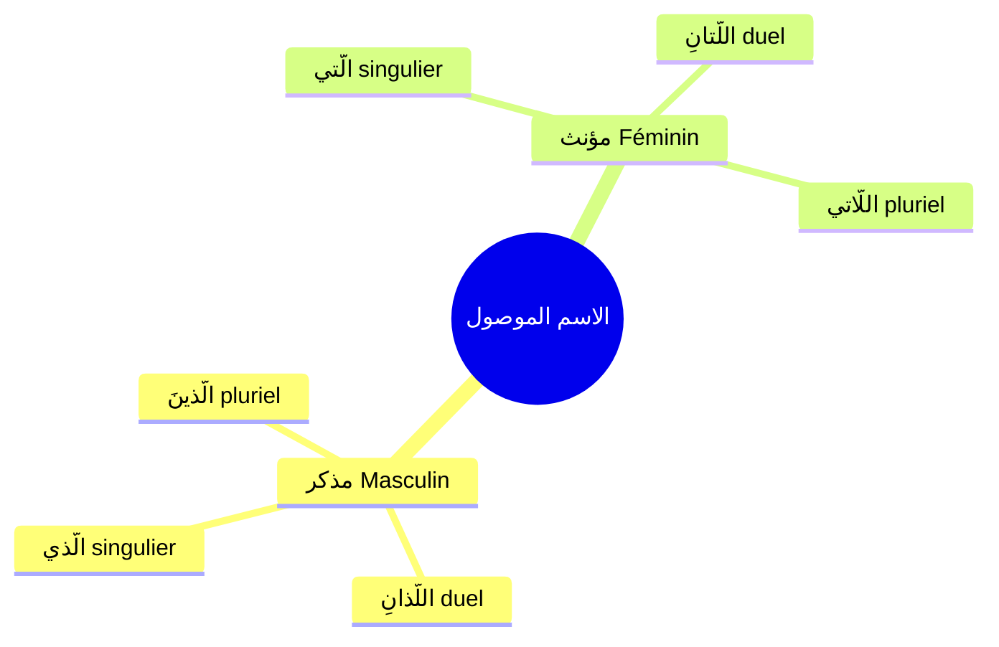

# الاسم الموصول — Le pronom relatif

Le **الاسم الموصول** est un **اسم** (nom) qui sert à **relier** deux phrases ensemble. C'est l'équivalent de **"qui", "que", "dont"** en français.

> [!tip]
> 💡 **C'est une des 6 catégories de [[Revision - Grammaire Arabe|معرفة]] (Maʿrifa)** → il est toujours **déterminé**.

---

## 📌 Tableau des أسماء الموصولة

| Genre / Nombre | النوع | الاسم الموصول | Traduction |
|---|---|---|---|
| **Masculin singulier** | المفرد المذكر | **الَّذي** | qui / que (masc. sing.) |
| **Féminin singulier** | المفرد المؤنث | **الَّتي** | qui / que (fém. sing.) |
| **Duel masculin** | المثنى المذكر | **اللَّذانِ** | qui / que (deux masc.) |
| **Duel féminin** | المثنى المؤنث | **اللَّتانِ** | qui / que (deux fém.) |
| **Pluriel masculin** | جمع المذكر | **الَّذينَ** | qui / que (plur. masc.) |
| **Pluriel féminin** | جمع المؤنث | **اللَّاتي / اللَّواتي** | qui / que (plur. fém.) |

> [!info]
> L'اسم الموصول **s'accorde** avec le nom qu'il remplace en **genre** (مذكر / مؤنث) et en **nombre** (مفرد / مثنى / جمع).

---

## صلة الموصول — La proposition relative

Après l'اسم الموصول, il faut **obligatoirement** une phrase qui complète le sens. On l'appelle **صلة الموصول**.

> [!warning]
> ⚠️ **Règle :** الاسم الموصول + صلة الموصول = une unité complète
> 
> L'اسم الموصول **ne peut pas** être seul. Il a **toujours** besoin d'une صلة الموصول (proposition relative) après lui.
> 
> La صلة الموصول doit contenir un **عائد** (pronom de rappel) qui renvoie à l'اسم الموصول.

> [!tip]
> 💡 Exemple décomposé :
> 
> **جاءَ الطالبُ الَّذي نجحَ** = L'élève **qui** a réussi est venu
> 
> • **الطالبُ** = le nom décrit
> • **الَّذي** = الاسم الموصول (qui)
> • **نجحَ** = صلة الموصول (la proposition relative : "a réussi")
> • Le عائد (pronom de rappel) est **caché** dans le verbe نجحَ (= il a réussi → le "il" renvoie à الطالب)

---

## الَّذي — qui / que (masculin singulier)

> [!info]
> **الَّذي** = اسم موصول للمفرد المذكر
> 
> C'est le plus utilisé. Il renvoie à un nom **masculin singulier**.

| Phrase                       | Traduction                                 |
|---|---|
| جاءَ الرجلُ **الَّذي** درسَ       | L'homme **qui** a étudié est venu          |
| قرأتُ الكتابَ **الَّذي** اشتريتَهُ | J'ai lu le livre **que** tu as acheté      |
| هذا هو الطالبُ **الَّذي** نجحَ   | C'est l'élève **qui** a réussi             |
| رأيتُ المعلمَ **الَّذي** علّمَني   | J'ai vu le professeur **qui** m'a enseigné |

---

## الَّتي — qui / que (féminin singulier)

> [!info]
> **الَّتي** = اسم موصول للمفرد المؤنث
> 
> Il renvoie à un nom **féminin singulier**.

| Phrase | Traduction |
|---|---|
| جاءتِ الطالبةُ **الَّتي** نجحتْ | L'étudiante **qui** a réussi est venue |
| قرأتُ القصةَ **الَّتي** كتبتِها | J'ai lu l'histoire **que** tu as écrite |
| هذه المدرسةُ **الَّتي** درستُ فيها | C'est l'école dans **laquelle** j'ai étudié |

---

## اللَّذانِ — qui / que (duel masculin)

| Phrase | Traduction |
|---|---|
| جاءَ الطالبانِ **اللَّذانِ** نجحا | Les deux étudiants **qui** ont réussi sont venus |
| رأيتُ الرجلينِ **اللَّذَيْنِ** سافرا | J'ai vu les deux hommes **qui** ont voyagé |

> [!tip]
> 💡 Au **منصوب / مجرور**, اللَّذانِ devient **اللَّذَيْنِ** (comme le مثنى normal).

---

## اللَّتانِ — qui / que (duel féminin)

| Phrase | Traduction |
|---|---|
| جاءتِ الطالبتانِ **اللَّتانِ** نجحتا | Les deux étudiantes **qui** ont réussi sont venues |
| رأيتُ المعلمتينِ **اللَّتَيْنِ** علّمتاني | J'ai vu les deux professeures **qui** m'ont enseigné |

> [!tip]
> 💡 Au **منصوب / مجرور**, اللَّتانِ devient **اللَّتَيْنِ**.

---

## الَّذينَ — qui / que (pluriel masculin)

| Phrase | Traduction |
|---|---|
| جاءَ الطلابُ **الَّذينَ** نجحوا | Les étudiants **qui** ont réussi sont venus |
| رأيتُ الرجالَ **الَّذينَ** سافروا | J'ai vu les hommes **qui** ont voyagé |
| سلّمتُ على المعلمينَ **الَّذينَ** علّموني | J'ai salué les professeurs **qui** m'ont enseigné |

> [!info]
> **الَّذينَ** ne change **pas** de forme : il reste الَّذينَ dans tous les cas (مرفوع، منصوب، مجرور).

---

## اللَّاتي / اللَّواتي — qui / que (pluriel féminin)

| Phrase | Traduction |
|---|---|
| جاءتِ الطالباتُ **اللَّاتي** نجحْنَ | Les étudiantes **qui** ont réussi sont venues |
| رأيتُ المعلماتِ **اللَّواتي** علّمْنَني | J'ai vu les professeures **qui** m'ont enseigné |

> [!tip]
> 💡 **اللَّاتي** et **اللَّواتي** ont le même sens. Les deux formes sont correctes.

---

## العائد — Le pronom de rappel

La صلة الموصول contient souvent un **عائد** (pronom de rappel) qui renvoie à l'اسم الموصول :

| Phrase | Le عائد | Explication |
|---|---|---|
| قرأتُ الكتابَ الَّذي اشتريتَ**هُ** | **هُ** | Le ه renvoie à الكتاب (le livre que tu as acheté → tu l'as acheté) |
| هذه المدرسةُ الَّتي درستُ **فيها** | **ها** | Le ها renvoie à المدرسة (l'école dans laquelle j'ai étudié) |
| جاءَ الطالبُ الَّذي نجحَ | (caché) | Le عائد est le ضمير مستتر (هو) caché dans le verbe نجحَ |

> [!warning]
> ⚠️ **Attention :** Le عائد peut être :
> 
> • **[[Damaair - Les pronoms|ضمير متصل]]** (pronom attaché) : اشتريتَ**هُ**، درستُ في**ها**
> • **ضمير مستتر** (pronom caché) : نجحَ (= هو نجحَ)

---

## 🧠 Résumé

|  | المفرد (singulier) | المثنى (duel) | الجمع (pluriel) |
|---|---|---|---|
| **مذكر (masc.)** | **الَّذي** | **اللَّذانِ / اللَّذَيْنِ** | **الَّذينَ** |
| **مؤنث (fém.)** | **الَّتي** | **اللَّتانِ / اللَّتَيْنِ** | **اللَّاتي / اللَّواتي** |

> [!warning]
> ⚠️ **3 choses à retenir :**
> 
> **1.** الاسم الموصول est toujours **معرفة** (déterminé)
> 
> **2.** Il a toujours besoin d'une **صلة الموصول** (proposition relative) après lui
> 
> **3.** La صلة الموصول contient un **عائد** (pronom de rappel) qui renvoie à l'اسم الموصول

> [!tip]
> 💡 **Astuce :**
> • Masculin → الَّذي / اللَّذانِ / الَّذينَ (commence par **ذ**)
> • Féminin → الَّتي / اللَّتانِ / اللَّاتي (commence par **ت** ou **لا**)
