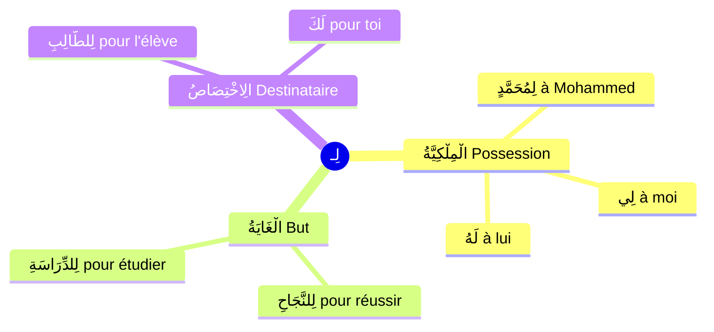

# لِـ (اللَّامُ) — Pour / À / Appartient à

Voir aussi : [[Huruf Al-Jar - Prepositions]] · [[3inda - Chez Avoir]]

---

## C'est quoi لِـ ?

> [!info]
> **لِـ** (lam) est un **حَرْفُ جَرٍّ** qui se colle directement au mot suivant. Il a **3 sens principaux** :
> 1. **La possession** → à qui appartient quelque chose
> 2. **Le destinataire** → pour qui
> 3. **Le but** → pour faire quoi

---

## 1️⃣ لِـ = la possession (الْمِلْكِيَّةُ)

C'est le sens le plus courant. **لِـ** exprime **à qui** appartient quelque chose.

> [!warning]
> **Règle :** Le mot après لِـ est toujours **مَجْرُورٌ** (comme tout حَرْفِ جَرٍّ).

### لِمَنْ هٰذَا ؟ — À qui est-ce ?

**لِمَنْ** = لِـ + مَنْ = **à qui ?** / **pour qui ?**

| Question | Réponse | Traduction |
|---|---|---|
| **لِمَنْ** هٰذَا الْكِتَابُ ؟ | الْكِتَابُ **لِمُحَمَّدٍ** | À qui est ce livre ? — Il est à Mohammed |
| **لِمَنْ** هٰذِهِ السَّيَّارَةُ ؟ | السَّيَّارَةُ **لِلْمُعَلِّمِ** | À qui est cette voiture ? — Au professeur |
| **لِمَنْ** هٰذَا الْقَلَمُ ؟ | الْقَلَمُ **لِي** | À qui est ce stylo ? — Il est à moi |

### Exemples avec des noms

| Phrase | Traduction | إِعْرَابُ du mot après لِـ |
|---|---|---|
| الْكِتَابُ **لِمُحَمَّدٍ** | Le livre est à Mohammed | مُحَمَّدٍ : مَجْرُورٌ بِالْكَسْرَةِ (+ tanwīn car نَكِرَة... non, c'est un عَلَمٌ mais il accepte le tanwīn) |
| هٰذَا الْبَيْتُ **لِلطَّالِبِ** | Cette maison est à l'étudiant | الطَّالِبِ : مَجْرُورٌ بِالْكَسْرَةِ |
| الْقَلَمُ **لِفَاطِمَةَ** | Le stylo est à Fatima | فَاطِمَةَ : مَجْرُورٌ بِالْ**فَتْحَةِ** (مَمْنُوعٌ مِنَ الصَّرْفِ !) |
| الْحَمْدُ **لِلَّهِ** | La louange est à Allah | اللَّهِ : مَجْرُورٌ بِالْكَسْرَةِ |

> [!tip]
> **لِـ + الـ = لِلْـ**
>
> Quand لِـ rencontre الـ (article), le alif de الـ tombe :
> - لِـ + الطَّالِبُ = **لِلطَّالِبِ** (pas لِالطَّالِبِ)
> - لِـ + اللَّهُ = **لِلَّهِ**

---

## 2️⃣ لِـ + الضَّمَائِرُ — Avec les pronoms

C'est là que لِـ devient très utile au quotidien :

| الضَّمِيرُ | لِـ + ضَمِيرٌ | Traduction | Exemple |
|---|---|---|---|
| أَنَا | **لِي** | à moi / j'ai | **لِي** كِتَابٌ |
| أَنْتَ | **لَكَ** | à toi (m.) | **لَكَ** هَدِيَّةٌ |
| أَنْتِ | **لَكِ** | à toi (f.) | **لَكِ** رِسَالَةٌ |
| هُوَ | **لَهُ** | à lui | **لَهُ** سَيَّارَةٌ |
| هِيَ | **لَهَا** | à elle | **لَهَا** بَيْتٌ |
| نَحْنُ | **لَنَا** | à nous | **لَنَا** حَقٌّ |
| أَنْتُمْ | **لَكُمْ** | à vous (m.) | **لَكُمْ** دِينُكُمْ |
| هُمْ | **لَهُمْ** | à eux | **لَهُمْ** أَوْلَادٌ |

> [!warning]
> **لِي** (à moi) vs **عِنْدِي** (chez moi) :
>
> Les deux expriment la possession, mais :
> - **لِي** = la chose **m'appartient** (propriété)
> - **عِنْدِي** = la chose **est chez moi** (elle peut ne pas m'appartenir)
>
> | Phrase | Sens |
> |---|---|
> | **لِي** كِتَابٌ | J'ai un livre (il m'appartient) |
> | **عِنْدِي** كِتَابٌ | J'ai un livre (il est chez moi, peut-être emprunté) |
>
> En pratique, les deux sont souvent interchangeables au quotidien.

---

## 3️⃣ لِـ = le but / la finalité (الْغَايَةُ)

| Phrase | Traduction |
|---|---|
| جِئْتُ **لِلدِّرَاسَةِ** | Je suis venu **pour** étudier |
| سَافَرْتُ **لِلْعَمَلِ** | J'ai voyagé **pour** le travail |
| هٰذَا **لِلْأَكْلِ** | C'est **pour** manger |

---

## 4️⃣ لِـ = le destinataire (الِاخْتِصَاصُ)

| Phrase | Traduction |
|---|---|
| اشْتَرَيْتُ هَدِيَّةً **لِأَبِي** | J'ai acheté un cadeau **pour** mon père |
| هٰذَا الْكِتَابُ **لَكَ** | Ce livre est **pour toi** |
| الْجَنَّةُ **لِلْمُؤْمِنِينَ** | Le paradis est **pour** les croyants |

---

## Dialogues pratiques

### Dialogue 1 : À qui est ce livre ?

> — **لِمَنْ** هٰذَا الْكِتَابُ ؟
> — هٰذَا الْكِتَابُ **لِمُحَمَّدٍ**.
> — وَهٰذَا الْقَلَمُ ؟ **لِمَنْ** هُوَ ؟
> — هُوَ **لِي**.

### Dialogue 2 : Tu as quelque chose ?

> — هَلْ **لَكَ** إِخْوَةٌ ؟ (As-tu des frères ?)
> — نَعَمْ، **لِي** ثَلَاثَةُ إِخْوَةٍ. (Oui, j'ai 3 frères)
> — وَ**لَكَ** أَخَوَاتٌ ؟ (Et des sœurs ?)
> — لَا، **لَيْسَ لِي** أَخَوَاتٌ. (Non, je n'ai pas de sœurs)

### Dialogue 3 : Pour qui est le cadeau ?

> — **لِمَنْ** هٰذِهِ الْهَدِيَّةُ ؟ (Pour qui est ce cadeau ?)
> — هِيَ **لِأُمِّي**. (Pour ma mère)

---

## La négation avec لِـ

| Affirmation | Négation | Traduction |
|---|---|---|
| **لِي** كِتَابٌ | **لَيْسَ لِي** كِتَابٌ | Je n'ai pas de livre |
| **لَهُ** سَيَّارَةٌ | **لَيْسَ لَهُ** سَيَّارَةٌ | Il n'a pas de voiture |
| **لَنَا** وَقْتٌ | **لَيْسَ لَنَا** وَقْتٌ | Nous n'avons pas le temps |

> [!info]
> On peut aussi utiliser **مَا** : **مَا لِي** كِتَابٌ = Je n'ai pas de livre.

---

## 🧠 Résumé

> [!tip]
> **لِـ est un حَرْفُ جَرٍّ** qui se colle au mot. Il rend le mot **مَجْرُورٌ**.
>
> | Utilisation | Exemple | Traduction |
> |---|---|---|
> | **Possession** | الْكِتَابُ لِمُحَمَّدٍ | Le livre est à Mohammed |
> | **Question** | لِمَنْ هٰذَا ؟ | À qui est-ce ? |
> | **Avec pronom** | لِي / لَكَ / لَهُ | à moi / à toi / à lui |
> | **But** | جِئْتُ لِلدِّرَاسَةِ | Je suis venu pour étudier |
> | **Destinataire** | هَدِيَّةٌ لِأَبِي | Un cadeau pour mon père |
> | **Négation** | لَيْسَ لِي | Je n'ai pas |
>
> **لِـ + الـ = لِلْـ** (le alif tombe)
>
> **لِي** (propriété) vs **[[3inda - Chez Avoir|عِنْدِي]]** (possession physique)
