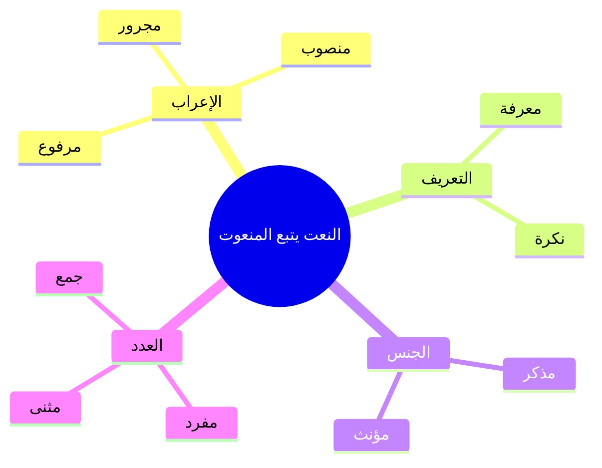

# النعت والمنعوت — L'adjectif et le qualifié

En arabe, quand on décrit un nom avec un adjectif, on appelle ça **النعت والمنعوت**.

| Terme | En arabe | C'est quoi ? | Exemple |
|---|---|---|---|
| **المنعوت** | الاسم الموصوف | Le nom qu'on décrit (le qualifié) | **الطالبُ** |
| **النعت** | الصفة | L'adjectif qui décrit (le qualificatif) | **المجتهدُ** |

> [!info]
> Exemple complet : **الطالبُ المجتهدُ** = L'élève studieux
> 
> الطالبُ = المنعوت (le qualifié)
> المجتهدُ = النعت (l'adjectif)

---

## القاعدة — La règle principale

> [!warning]
> ⚠️ **النعت يتبع المنعوت في أربعة أشياء**
> 
> Le نعت (adjectif) doit **suivre** le منعوت (nom) dans **4 choses** :
> 
> **1. [[Revision - Grammaire Arabe|الإعراب]]** — le cas grammatical (مرفوع / منصوب / مجرور)
> **2. التعريف والتنكير** — défini ou indéfini (معرفة / نكرة)
> **3. الجنس** — le genre (مذكر / مؤنث)
> **4. العدد** — le nombre (مفرد / [[Muthanna - Le duel|مثنى]] / جمع)

---

## 1️⃣ التطابق في الإعراب — Accord en cas grammatical

Si le منعوت est مرفوع → le نعت est aussi مرفوع, etc.

| الإعراب   | Phrase                      | Traduction                  |
|---|---|---|
| **مرفوع** | جاءَ **الطالبُ المجتهدُ**      | L'élève studieux est venu   |
| **منصوب** | رأيتُ **الطالبَ المجتهدَ**     | J'ai vu l'élève studieux    |
| **مجرور** | سلّمتُ على **الطالبِ المجتهدِ** | J'ai salué l'élève studieux |

> [!tip]
> 💡 Les deux mots ont **toujours la même voyelle à la fin** : ُ ُ ou َ َ ou ِ ِ

---

## 2️⃣ التطابق في التعريف والتنكير — Accord en définition

Si le منعوت est معرفة (avec ال) → le نعت aussi. Si le منعوت est نكرة (sans ال) → le نعت aussi.

<table>
<colgroup>
<col style="width: 33%" />
<col style="width: 33%" />
<col style="width: 33%" />
</colgroup>
<thead>
<tr>
<th>النوع</th>
<th>Phrase</th>
<th>Traduction</th>
</tr>
</thead>
<tbody>
<tr>
<td><strong>معرفة + معرفة</strong> 
(les deux avec ال)</td>
<td class="big"><strong>الكتابُ الجديدُ</strong></td>
<td><strong>Le</strong> livre <strong>nouveau</strong> (= le nouveau livre)</td>
</tr>
<tr>
<td><strong>نكرة + نكرة</strong> 
(les deux sans ال)</td>
<td class="big"><strong>كتابٌ جديدٌ</strong></td>
<td><strong>Un</strong> livre <strong>nouveau</strong> (= un nouveau livre)</td>
</tr>
</tbody>
</table>

> [!warning]
> ❌ On ne peut **PAS** mélanger :
> الكتابُ جديدٌ ← Ce n'est **PAS** un نعت ! C'est une **جملة اسمية** (phrase nominale) = "Le livre est nouveau"

---

## 3️⃣ التطابق في الجنس — Accord en genre

Si le منعوت est مذكر (masculin) → le نعت est مذكر. Si le منعوت est مؤنث (féminin) → le نعت est مؤنث.

| الجنس           | Phrase           | Traduction          |
|---|---|---|
| **مذكر + مذكر** | طالبٌ **مجتهدٌ**   | Un élève studieux   |
| **مؤنث + مؤنث** | طالبةٌ **مجتهدةٌ** | Une élève studieuse |

> [!tip]
> 💡 Le féminin se forme souvent en ajoutant **ة** (ta marbūta) : مجتهد → مجتهد**ة**

---

## 4️⃣ التطابق في العدد — Accord en nombre

<table>
<colgroup>
<col style="width: 33%" />
<col style="width: 33%" />
<col style="width: 33%" />
</colgroup>
<thead>
<tr>
<th>العدد</th>
<th>Phrase</th>
<th>Traduction</th>
</tr>
</thead>
<tbody>
<tr>
<td><strong>مفرد + مفرد</strong> 
(singulier)</td>
<td class="big">رجلٌ <strong>كريمٌ</strong></td>
<td>Un homme généreux</td>
</tr>
<tr>
<td><strong>مثنى + مثنى</strong> 
(duel)</td>
<td class="big">رجلانِ <strong>كريمانِ</strong></td>
<td>Deux hommes généreux</td>
</tr>
<tr>
<td><strong>جمع + جمع</strong> 
(pluriel)</td>
<td class="big">رجالٌ <strong>كرماءُ</strong></td>
<td>Des hommes généreux</td>
</tr>
</tbody>
</table>

---

## أمثلة شاملة — Exemples complets

| المنعوت | النعت | الجملة | Traduction | التطابق |
|---|---|---|---|---|
| البيتُ | الكبيرُ | **البيتُ الكبيرُ** | La grande maison | مرفوع، معرفة، مذكر، مفرد |
| سيارةً | جميلةً | رأيتُ **سيارةً جميلةً** | J'ai vu une belle voiture | منصوب، نكرة، مؤنث، مفرد |
| المدرسةِ | الكبيرةِ | في **المدرسةِ الكبيرةِ** | Dans la grande école | مجرور، معرفة، مؤنث، مفرد |
| طلابٌ | مجتهدونَ | هؤلاءِ **طلابٌ مجتهدونَ** | Ceux-ci sont des élèves studieux | مرفوع، نكرة، مذكر، جمع |
| الولدِ | الصغيرِ | سلّمتُ على **الولدِ الصغيرِ** | J'ai salué le petit garçon | [[Revision - Grammaire Arabe\|مجرور]]، معرفة، مذكر، مفرد |

---

## ⚠️ النعت والخبر — Attention à ne pas confondre !

La différence entre **النعت** (adjectif) et **الخبر** (prédicat) :

| Structure | Phrase | Traduction | C'est quoi ? |
|---|---|---|---|
| **معرفة + معرفة** | الكتابُ **الجديدُ** | Le nouveau livre | **نعت** (adjectif) |
| **معرفة + نكرة** | الكتابُ **جديدٌ** | Le livre **est** nouveau | **خبر** (prédicat = phrase complète) |

> [!tip]
> 💡 **Astuce :**
> • **الكتابُ الجديدُ** (les deux avec ال) = le nouveau livre → **نعت**
> • **الكتابُ جديدٌ** (un avec ال, l'autre sans) = le livre EST nouveau → **خبر** (phrase nominale)

---

## 🧠 Résumé

> [!warning]
> **النعت يتبع المنعوت في :**
> 
> 
> | \#  | التطابق              | Accord en...    | Exemple                         |
> |---|---|---|---|
> | 1   | **الإعراب**          | Cas grammatical | الطالبُ المجتهدُ / الطالبَ المجتهدَ |
> | 2   | **التعريف والتنكير** | Définition      | الكتابُ الجديدُ / كتابٌ جديدٌ       |
> | 3   | **الجنس**            | Genre           | طالبٌ مجتهدٌ / طالبةٌ مجتهدةٌ       |
> | 4   | **العدد**            | Nombre          | رجلٌ كريمٌ / رجلانِ كريمانِ         |
