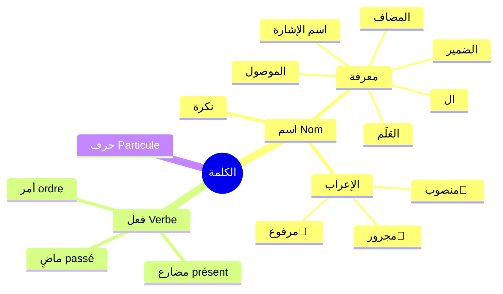

# Les 3 types de mots en arabe — أقسام الكلام

En arabe, tout mot appartient à l'une de ces 3 catégories :

### 1️⃣ اسم (Ism) — Le nom

Un mot qui :

- **A un sens en lui-même** (يدل على معنى في نفسه)
- **N'est PAS lié à un temps** (غير مقترن بزمن)

**Exemples :** كتاب = livre, رجل = homme, جميل = beau, هو = lui

> [!info]
> Tout ce qui n'est ni verbe ni particule est un اسم.

### 2️⃣ فعل (Fiʿl) — Le verbe

Un mot qui :

- **A un sens en lui-même**
- **EST lié à un temps** (مقترن بزمن) → passé, présent ou futur

**Exemples :** كَتَبَ = il a écrit (passé), يَكْتُبُ = il écrit (présent), اُكْتُبْ = écris ! (ordre)

### 3️⃣ حرف (Ḥarf) — La particule

Un mot qui :

- **N'a PAS de sens tout seul** (لا يدل على معنى في نفسه)
- Il a besoin d'un autre mot pour avoir un sens

**Exemples :** في = dans, من = de, إلى = vers, على = sur, إنَّ = certes (voir [[Huruf Al-Jar - Prepositions|حروف الجر]])

### 🧠 Résumé

| Type                | Sens en lui-même ? | Lié au temps ? |
|---|---|---|
| **اسم** (Nom)       | Oui                | Non            |
| **فعل** (Verbe)     | Oui                | Oui            |
| **حرف** (Particule) | Non                | Non            |

> [!tip]
> 💡 **Le اسم (ism) peut être soit معرفة (Maʿrifa = déterminé), soit نكرة (Nakira = indéterminé).**

---

# 📘 Maʿrifa & Nakira — معرفة و نكرة

### ✅ Maʿrifa (المعرفة) = Déterminé

Un mot est **déterminé** quand on sait **précisément de quoi ou de qui on parle**.

- Précédé de **ال (al-)** → الكتاب (le livre)
- Un **nom propre** → محمد
- Un **pronom** → أنا, هو
- Un mot en **annexion avec quelque chose de défini** → كتابُ الطالبِ (le livre de l'élève)

### 📗 Nakira (النكرة) = Indéterminé

Un mot est **indéterminé** quand on parle de quelque chose de **général, pas précis**.

> [!tip]
> 💡 **Règle :** Tout mot qui **accepte الـ (alif wa lam)** est un نكرة (Nakira).
> Pose-toi la question : **est-ce que je peux ajouter الـ dessus ?**
> 
> • رجلٌ → est-ce que je peux dire الرجل ? **Oui** → donc رجلٌ est نكرة ✅
> • كتابٌ → est-ce que je peux dire الكتاب ? **Oui** → donc كتابٌ est نكرة ✅
> 
> Et si on **ne peut PAS** ajouter الـ → c'est معرفة (Maʿrifa) :
> • هذا → est-ce que je peux dire الهذا ? **Non** → donc هذا est معرفة ❌
> • قلمُ محمدٍ → est-ce que je peux dire القلمُ محمدٍ ? **Non** → c'est مضاف و مضاف إليه, donc معرفة ❌

Souvent, il porte le **tanwīn** (ٌ ً ٍ) :

- كتابٌ = un livre
- رجلٌ = un homme
- بيتٌ = une maison

> [!warning]
> ⚡ **Quand الـ rentre, le tanwīn part.**
> كتابٌ (un livre) → الكتابُ (le livre) — le tanwīn ٌ disparaît et devient ُ

---

## 📌 المعرفة ستة أنواع — Les 6 catégories de Maʿrifa

| \#  | النوع              | Catégorie          | Exemple     |
|---|---|---|---|
| 1️⃣  | **الضمير**         | Le pronom — [[Damaair - Les pronoms\|الضمائر]]          | أنا، هو     |
| 2️⃣  | **العَلَم**          | Le nom propre      | محمد        |
| 3️⃣  | **اسم الإشارة**    | Le démonstratif — [[Ism Ichara - Demonstratifs\|اسم الإشارة]]    | هذا، ذلك    |
| 4️⃣  | **الاسم الموصول**  | Le relatif — [[Ism Mawsul - Pronom relatif\|الاسم الموصول]]         | الذي        |
| 5️⃣  | **المعرّف بـ الـ**  | Le mot avec ال     | القلم       |
| 6️⃣  | **المضاف** (الأقل) | Le mot en annexion | كتابُ الطالبِ |

---

## الإعراب — Les 3 états du اسم

| État | Nom arabe | Voyelle | Exemple |
|---|---|---|---|
| 1️⃣ | **مرفوع** (Marfūʿ) | ُ (damma) | جاءَ **الطالبُ** = l'élève est venu |
| 2️⃣ | **منصوب** (Manṣūb) | َ (fatha) | رأيتُ **الطالبَ** = j'ai vu l'élève |
| 3️⃣ | **مجرور** (Majrūr) | ِ (kasra) | مررتُ **بالطالبِ** = je suis passé par l'élève |

> [!warning]
> ⚠️ **Attention : le signe du إعراب n'est pas toujours la voyelle classique !**
> Pour les **الأسماء الخمسة** (les 5 noms), quand ils sont مضاف, le signe change :
> 
> Les 5 noms : **أب** (père), **أخ** (frère), **حم** (beau-père), **فو** (bouche), **ذو** (possesseur de) — voir [[Al-Asma Al-Khamsa - Les 5 noms|الأسماء الخمسة]]

| État | Signe normal | Signe des أسماء الخمسة | Exemple |
|---|---|---|---|
| مرفوع | ُ (damma) | **و** (waw) | جاءَ **أبوكَ** = ton père est venu |
| منصوب | َ (fatha) | **ا** (alif) | رأيتُ **أباكَ** = j'ai vu ton père |
| مجرور | ِ (kasra) | **ي** (ya) | مررتُ **بأبيكَ** = je suis passé par ton père |

---

## ⚠️ علامة الرفع — Le signe du مرفوع selon la catégorie

Le signe normal du مرفوع est la **ضمة (ُ)**, mais certaines catégories ont un signe différent :

| Catégorie | Signe du مرفوع | Exemple |
|---|---|---|
| **[[Al-Asma Al-Khamsa - Les 5 noms\|الأسماء الخمسة]]** (les 5 noms) | **الواو** (waw) | أبُو بكرٍ |
| **[[Muthanna - Le duel\|المثنى]]** (le duel) | **الألف** (alif) | رجُلانِ |
| **جمع المذكر السالم** (pluriel masc. régulier) | **الواو** (waw) | المسلمُونَ |
| **جمع المؤنث السالم** (pluriel fém. régulier) | **الضمة** (damma) ✅ normal | المسلماتُ |
| **[[Mamnu min Sarf - Interdit de tanwin\|الممنوع من الصرف]]** (diptote) | **الضمة** (damma) ✅ normal | عائشةُ |

---

## ⚠️ علامات النصب — Le signe du منصوب selon la catégorie

Le signe normal du منصوب est la **فتحة (َ)**, mais certaines catégories ont un signe différent :

| Catégorie | Signe du منصوب | Exemple |
|---|---|---|
| **الأسماء الخمسة** (les 5 noms) | **الألف** (alif) | رأيتُ أبَا بكرٍ |
| **المثنى** (le duel) | **الياء** (ya) | رأيتُ رجُلَيْنِ |
| **جمع المذكر السالم** (pluriel masc. régulier) | **الياء** (ya) | رأيتُ المسلمِينَ |
| **جمع المؤنث السالم** (pluriel fém. régulier) | **الكسرة** (kasra) | رأيتُ المسلماتِ |
| **الممنوع من الصرف** (diptote) | **الفتحة** (fatha) ✅ normal | رأيتُ عائشةَ |

---

## ⚠️ علامة الجر — Le signe du مجرور selon la catégorie

Le signe normal du مجرور est la **كسرة (ِ)**, mais certaines catégories ont un signe différent :

| Catégorie | Signe du مجرور | Exemple |
|---|---|---|
| **الأسماء الخمسة** (les 5 noms) | **ياء** (ya) | سلّمتُ على أبِي بكرٍ |
| **المثنى** (le duel) | **الياء** (ya) | سلّمتُ على رجُلَيْنِ |
| **جمع المذكر السالم** (pluriel masc. régulier) | **الياء** (ya) | سلّمتُ على المسلمِينَ |
| **جمع المؤنث السالم** (pluriel fém. régulier) | **الكسرة** (kasra) ✅ normal | سلّمتُ على المسلماتِ |
| **الممنوع من الصرف** (diptote) | **الفتحة** (fatha) | سلّمتُ على عائشةَ |

---

## Les 3 états du mot en arabe — Marfūʿ, Manṣūb, Majrūr

En arabe, un mot peut changer sa fin selon son rôle dans la phrase.

### 1️⃣ Marfūʿ (مرفوع) — ُ = ou

**C'est quand ?** Souvent quand le mot est :

- Le sujet de la phrase
- Le prédicat
- Après كان et ses sœurs (au début)

**Exemples :**

- الولدُ يكتبُ 👉 Le garçon écrit (الولدُ finit par ُ = marfūʿ)
- الجوُّ جميلٌ 👉 Le temps est beau

### 2️⃣ Manṣūb (منصوب) — َ = a

**C'est quand ?** Souvent quand le mot est :

- Le complément d'objet
- Après certains mots comme : إنَّ, أنَّ, لن

**Exemples :**

- قرأتُ الكتابَ 👉 J'ai lu le livre (الكتابَ finit par َ = manṣūb)
- إنَّ الولدَ ذكيٌّ 👉 Le garçon est intelligent

### 3️⃣ Majrūr (مجرور) — ِ = i

**C'est quand ?** Un اسم est majrūr dans 3 cas :

- **1. Après un [[Huruf Al-Jar - Prepositions|حرف جر]]** : في، على، من، إلى، مع، بـ، لـ
- **2. Quand il est مضاف إليه** : le deuxième mot d'une إضافة
- **3. Quand il suit un اسم déjà majrūr** : c'est التوابع — comme [[Na3t Man3ut - Adjectif qualificatif|النعت]], [[Badal - La substitution|البدل]], etc.

**Exemples :**

- في البيتِ 👉 Dans la maison (cas 1 : après حرف جر)
- كتابُ الطالبِ 👉 Le livre de l'élève (cas 2 : مضاف إليه)
- في البيتِ الكبيرِ 👉 Dans la grande maison (cas 3 : نعت qui suit un mot majrūr)

### 🧠 Résumé ultra simple

| État                  | Nom arabe      | Ça finit par | Son |
|---|---|---|---|
| Sujet                 | Marfūʿ (مرفوع) | ُ             | ou  |
| Objet                 | Manṣūb (منصوب) | َ             | a   |
| Après "dans / de / à" | Majrūr (مجرور) | ِ             | i   |

> [!info]
> ⚡ **Astuce rapide :**
> • **Qui fait l'action ?** → ُ marfūʿ
> • **Qui reçoit l'action ?** → َ manṣūb
> • **Après dans / à / de ?** → ِ majrūr
